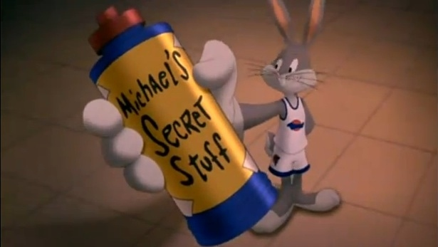
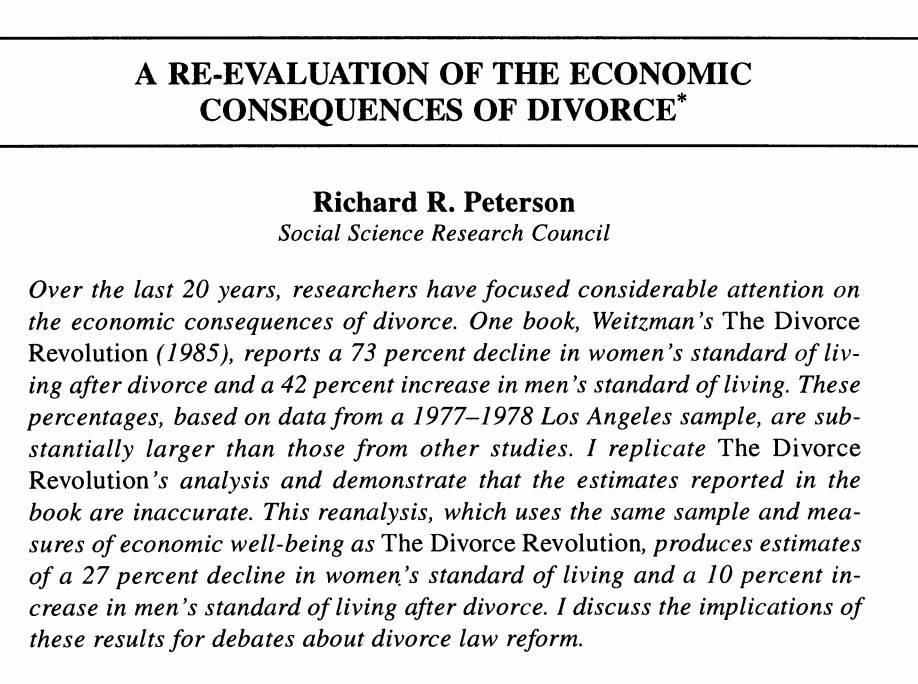
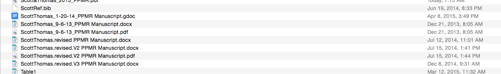
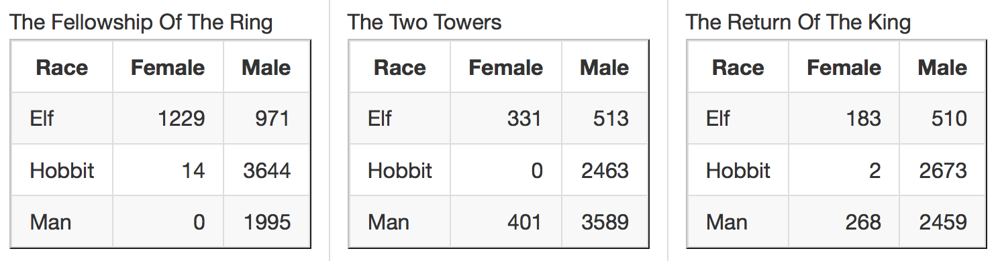
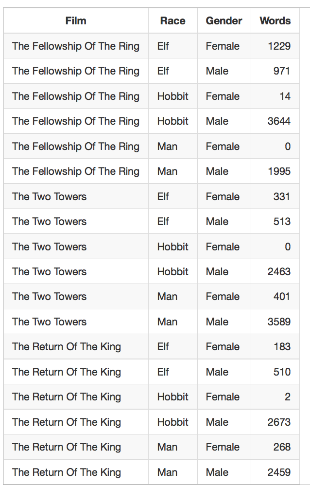

## The secret is:


- workflow is really important
- there are ideas and techniques that will help you
- after many painful mistakes you figure out some of them

Let's aim to avoid painful mistakes!

## Topics

- workflow
- data manipulation
- version control

## Goals

After this class, students will be able to:

- explain why a modern workflow will help them
- begin to match data structures to tasks
- begin to recognize good and bad coding style
- use five main git operations: init, add, commit, push, pull 
- start a project with RStudio and keep it under version control with git
- submit your homework with git and github


## Example: The Divorce Revolution


- Change in living standard after divorce
  - for women declines 73% 
  - for men increases 42%

- American Sociological Association Book Award in 1986
- Between 1986 and 1993, cited in 348 social science articles and 250 law review articles
- Between 1986 and 1993, cited in 24 legal cases and *by* the Supreme Court
- Led to changes in divorce law in California

## The Divorce Revolution

<center>

</center>

##  The Divorce Revolution

"First, let me begin with Peterson's implied question: Was this responsible research and did I meet professional standards in analyzing these data?" [Weitzman (1996)](http://www.jstor.org/stable/2096364)

## The Divorce Revolution

". . . .Changes to the original raw data file resulting from this data cleaning process were made by a series of programming statements on a master SPSS system file. *The raw data file that is stored at the Murray Center is the original 'dirty data' file and does not include these cleaning changes*. . . ." [Weitzman (1996)](http://www.jstor.org/stable/2096364)

## 

"Unfortunately, the original cleaned master SPSS system file no longer exists. I assumed it was being copied and reformatted as I moved for job changes and fellowships from the project's original offices in Berkeley to Stanford (in 1979), then to Princeton (in 1983), back to Stanford (in 1984) and then to Harvard (in 1986). With each move, new programmers worked on the files to accommodate different computer systems." [Weitzman (1996)](http://www.jstor.org/stable/2096364)

## 

"Before I left Stanford I instructed my programmers to prepare all my data files for archiving. I know now (but did not know then) that the original master SPSS system file that I used for my book had been lost or damaged at some point and was not included among these files. The SPSS system file that I thought was the master SPSS system file was the result of the merging of many smaller subfiles that had been created for specific analyses. It later became apparent that a programming error had been made, and the subfiles were not ``keyed'' correctly: Not all of the data from each individual respondent were matched on the appropriate case ID number, and data from different respondents were merged under the same case ID. At present it is not possible to disentangle exactly what mismatch occurred for any specific respondent." [Weitzman (1996)](http://www.jstor.org/stable/2096364)

##

"When I could not replicate the analyses in my book with what I had mistakenly assumed was the archived master SPSS system file, I hired an independent consultant, Professor
Angela Aidala from Columbia University, to help me untangle what had happened.  She reviewed all of the project files, documentation, and codebooks, as well as the
available data and programming files to determine a possible computational error in the standard of living statistic. But she could not do this without an accurate data file to work with. We then went back to the original questionnaires and recoded a random sample of about 25 percent of the cases. There were so many discrepancies between the questionnaires and the 'dirty data' raw data file, and between the questionnaires and the mismatched SPSS system file, that we finally abandoned the effort and left a warning to all future researchers *that both files at the Murray Center were so seriously flawed that they could not be used*. It was a very sad, time consuming, and frustrating experience. . ." [Weitzman (1996)](http://www.jstor.org/stable/2096364)

## An example closer to home { .flexbox .vcenter .larger }



If you find yourself staring at a folder like this...

## Research pipeline

<center></center>

## Gentzkow and Shapiro:

- Automation
- Version control
- Directories
- Keys
- Abstraction
- Documentation
- Management
- Code style


# Automation

## Automation

Automation (as opposed to point-and-click) enables:

- replicability
- efficiency
- creativity

If you find yourself doing the same thing over and over, then you should consider automation. [Any examples?] 

## Automation

- High short-term startup costs

- High long-term benefits

- Doesn't have to be fancy

- Might be simple things like designing report so that you can run a new model and it automatically repopulates tables and figures. 

- Not always the right answer, but always worth considering

# Version control

## Version control

<div class="columns-2">
  <right></right>

- Do you think they use that system at Google?

- Version control let's you edit the same document while preserving the ability to "go back"

- We will use git and github.  

</div>

## git


- different model than dropbox
- not file model, but content model 
- matches RStudio project 
- can use git without github
- designed so that you have lots of control over your commits
- for our purposes: local copy and github copy

## github


- remote for git
- faciliates collaboration
- add extra social features

# Directories

## Directories

- separate directories by function
- separate files into inputs and outputs
- make directories portable

## Directories

<center>

</center>

https://www.flickr.com/photos/rwphoto/3476071029/

## Directories


<center>

</center>

https://www.flickr.com/photos/nohodamon/4825273149/

## Three sensible systems

- [Gentzkow and Shapiro](http://faculty.chicagobooth.edu/matthew.gentzkow/research/CodeAndData.pdf)
- [ProjectTemplate](http://projecttemplate.net/) by John Miles White and others
- [Teaching Integrity in Empirical Research](http://www.haverford.edu/TIER/) by Richard Ball and Norm Medeiros

# Keys, databases, and data structures

## Keys, databases, and data structures

Main points:

- There are many ways to store the same data; some are better than others 
- The way you organize your data for storage and analysis might be different
- Store data normalized and then de-normalize for analysis
- Like grammer, you can break these rules, but you should do so consciously

## Keys

*Keys* are really important:

- primary keys uniquely define rows
- primary keys can be simple (one column) or compound (more than one column)
- primary keys must be defined for each row

## Keys 

Question: If we were going to make a database of information about students in this class, is first_name a good primary key?

Answer: No, might not be unique.

## Keys 

Question: If we were going to make a database of information about students in this class, is first.name and last.name a good primary key?

Answer: Better, but what if we want to add to the database over time.

## Keys 

Question: If we were going to make a database of information about students in this class, is UGA ID number a good primary key?

Answer: Yes, unique and defined for each person.

## Tidy data

"a philosophy of data" that underlies many of our tools (e.g, dplyr)

[Wickham (2014)](http://www.jstatsoft.org/v59/i10/paper)

In tidy data:

- each variable forms a column
- each observation forms of a row
- each type of observation forms a table 

## Tidy data 

Tidy is not what the data looks like to your eye, it is what the data looks like to the computer

Store data for computers not people

## Untidy data


Not tidy. 

Three variables are religion, income, frequency.

## Tidy data (example)


## Tidy data

Example from [Jenny Bryan](https://github.com/datacarpentry/datacarpentry/blob/master/lessons/tidy-data/01-intro.md)

<center></center>

Q: Is this data tidy?

A: No.


## Tidy data

<center></center>

- What's the total number of words spoken by male hobbits?
- Does a certain Race dominate a movie? Does the dominant Race differ across the movies?
- How well does your approach scale if there were many more movies or if I provided you with updated data that includes all the Races (e.g. dwarves, orcs, etc.)?

## Tidy data

<center></center>

## Tidy data

What's the total number of words spoken by male hobbits?

```{r}
lotr <- read.csv("data/lotr_tidy.csv", header=TRUE)
suppressPackageStartupMessages(library(dplyr))
suppressPackageStartupMessages(library(ggplot2))

lotr %>% 
  filter(Gender=="Male", Race=="Hobbit") %>%
  summarise(total=sum(Words))
```

How well does your approach scale if there were many more movies or if I provided you with updated data that includes all the Races (e.g. dwarves, orcs, etc.)?

## Tidy data 

```{r}
words_by_film_race <- lotr %>% 
  group_by(Film, Race) %>% 
  summarise(Total.Words = sum(Words))
words_by_film_race
```

## Aim for tall and skinny

Tall skinny data looks bad to the eye, but seems to work better for computers

Short and wide good for looking at, bad for computers

<center></center>

## Summary

- How you store your data matters
- Keep normalized as long as possible, then modify (merge, reshape) for analysis 
- dplyr has great merge functions ("[two table-verbs](http://cran.r-project.org/web/packages/dplyr/vignettes/two-table.html)")
- [tidyr](http://cran.r-project.org/web/packages/tidyr/index.html) and [reshape2](http://cran.r-project.org/web/packages/reshape2/index.html) have great reshaping functions

## Questions

Questions about Keys, databases, and data structure

# Abstraction

## 

abstraction: "turning the specific instances of something into a general-purpose tool"

More concretely

- don't copy and paste
- don't repeat yourself
- write reusable code

Abstraction takes practice, and we will work on it all semester

##

Three techniques we will use to promote abstraction

- loops
- functions
- refactoring

## loops

Loops help you do the same thing over and over

## loops

```{r eval=FALSE}
model.us <- lm(us$income ~ us$edu)
```

```{r eval=FALSE}
model.us <- lm(us$income ~ us$edu)
model.uk <- lm(uk$income ~ uk$edu)
```

 . . . 
 
```{r eval=FALSE}
model.us <- lm(us$income ~ us$edu)
model.uk <- lm(uk$income ~ uk$edu)
model.de <- lm(uk$income ~ de$edu)
model.fr <- lm(fr$income ~ fr$edu)
model.jp <- lm(jp$income ~ jp$edu)
model.cn <- lm(cn$income ~ cn$edu)
```

- Who sees the mistake? 
- What if you want to change the model?

## loops

```{r eval=FALSE}
countries <- c("us", "uk", "de", "fr", "jp", "cn")
for (country.code in countries) {
  data.this.country <- filter(all.data, country==country.code)
  model[[country.code]] <- lm(data.this.country$income ~ data.this.country$edu)
}
```

- every country gets same regression
- easy to change

## loops

Questions about loops?

## functions

functions take inputs and return outputs

```{r eval=FALSE}
total <- sum(c(1, 2, 3))
```

functions are like you building your own tools

## functions 

*all* complicated pieces of software use functions

- allows for tests
- allows for seperation of concerns
- allows for easy reuse

## functions

<center></center>

```{r eval=FALSE}
  analytic.data <- run.processing.code(measured.data)
```

## functions

Questions about functions?


## refactoring

refactoring is a fancy name for re-writing your code.

Often you don't know the right abstractions at the beginning.

It is almost always worth it to take a few hours and rewrite your code with the right abstractions.  This happens *all the time* in real projects.

## abstraction

- loops
- functions
- refactoring

Questions about abstraction?

# Documentation
  
##

If you want to be able to reproduce your results 10 years from now, you need to write documentation.

- Write self-documenting code.
- Your code should be human-readable, not just computer-readable.
- Choose variable names that make sense.
- Your code should be clear to someone else.  And, that someone else could be you.
- Sometimes the best way to document is to refactor
- We are going to exchange code a lot so you will get practice with this

##

Questions about documentation?

# Management

##

Every large software project uses task-management software.

Mangagement and collaboration are related: we're going to use git and github.

# Code Style

## Code style

Why care about code style?

- fewer errors

- easier to change

- better for collaboration

- reproducible

- open

## Code style { .build }

- Our first step to writing beautiful code is to pick a set of code conventions.

- All code in this class will follow [Google's R Style Guide](https://google-styleguide.googlecode.com/svn/trunk/Rguide.xml).  These are the rules that they developed and use in Google so that they can write beautiful code.

- Google's success criteria: "Any programmer should be able to instantly understand structure of any code"

- For more on Google's R Style Guide see [Andy Chen's presentation at useR 2014](http://static.googleusercontent.com/media/research.google.com/en/us/pubs/archive/42577.pdf).

## Code style

File Names: File names should end in .R and, of course, be meaningful. 

```{r eval=FALSE}
predict_ad_revenue.R # Do
foo.R # Don't
```


## Code style

Identifiers: Don't use underscores ( _ ) or hyphens ( - ) in identifiers. Identifiers should be named according to the following conventions. The preferred form for variable names is all lower case letters and words separated with dots (`variable.name`), but variableName is also accepted; function names have initial capital letters and no dots (`FunctionName`); constants are named like functions but with an initial k.

Variable names:
```{r eval=FALSE}
avg.clicks # Do
avg_Clicks # Don't
ac # Don't
```

## Code style

Identifiers: Don't use underscores ( _ ) or hyphens ( - ) in identifiers. Identifiers should be named according to the following conventions. The preferred form for variable names is all lower case letters and words separated with dots (`variable.name`), but variableName is also accepted; function names have initial capital letters and no dots (`FunctionName`); constants are named like functions but with an initial k.

Function names:

```{r eval=FALSE}
CalculateAvgClicks # Do
calculate_avg_clicks # Don't
calculateAvgClicks # Don't
```


## Code style

- Code style is something we will work on throughout the semester.  Getting the code conventions right is just the first step.

- Just like learning to write, learning to code is hard, important, and possible.

- When you see me write bad code, correct me!

## Code style

For more see, [Google's R Style Guide](https://google-styleguide.googlecode.com/svn/trunk/Rguide.xml)

## Wrap-up

Gentzkow and Shapiro:

- Automation
- Version control
- Directories
- Keys
- Abstraction
- Documentation
- Management
- Code style

## Questions and comments?

## Goal check

## Wrap-up

Summary of material for next class
