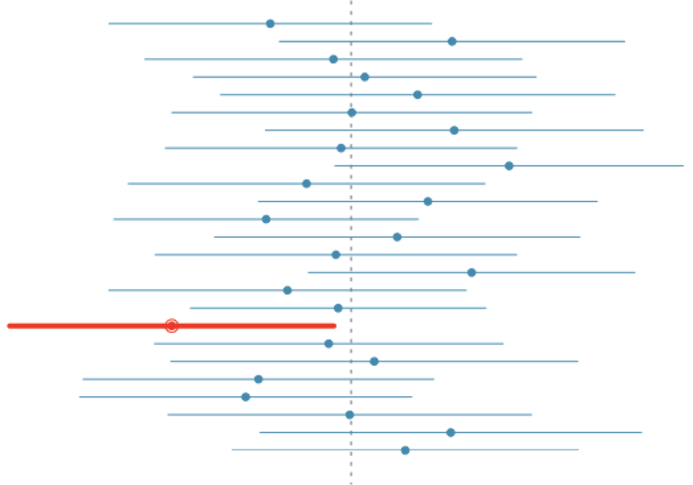
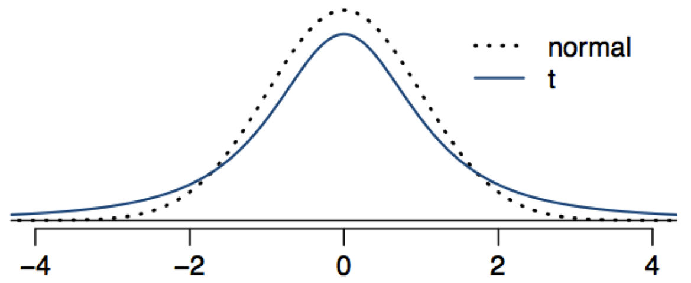
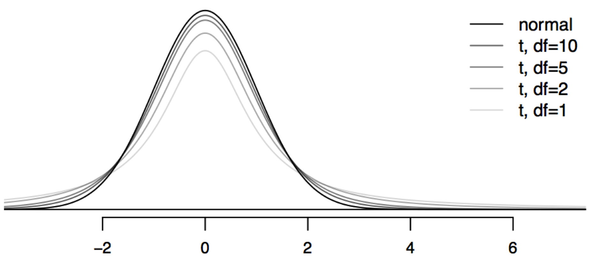

# Overview
 
## Today's Material

- Confidence intervals
- p-values
- Critical values
- Significance tests

## Where we are


# Confidence intervals

## Point estimates

-point estimates (even of non-random values) are not exact

```{r echo=FALSE,message=FALSE}
library(openintro)
library(zoo)
data(run10)
run10 = run10[1:10000,]
plot(cumsum(run10$time) / seq_along(run10$time),type='l',xlab='N',ylab='Mean 10k time',
     main='2010 Bloomsday 10k times: Rolling mean')
```


## Parameter estimation

- We are often interested in population parameters.

- Since complete populations are difficult (or impossible) to collect data on, we use sample statistics as point estimates for the unknown population parameters of interest.

- Sample statistics vary from sample to sample

- Quantifying how sample statistics vary provides a way to estimate the margin of error associated with our point estimate.

## 
Young, Underemployed and Optimistic: Coming of Age, Slowly, in a Tough Economy

"While negative trends in the labor market have been felt most acutely by the youngest workers, many adults in their late 20s and early 30s have also felt the impact of the weak economy. Among all 18- to 34-year-olds, fully half (49%) say they have taken a job they didn’t want just to pay the bills, with 24% saying they have taken an unpaid job to gain work experience. And more than one-third (35%) say that, as a result of the poor economy, they have gone back to school. Their personal lives have also been affected: 31% have postponed either getting married or having a baby (22% say they have postponed having a baby and 20% have put off getting married). One-in-four (24%) say they have moved back in with their parents after living on their own."

http://www.pewsocialtrends.org/2012/02/09/young-underemployed-and-optimistic/

## Margin of error

"Margin of sampling error is plus or minus 2.9 percentage points for results based on the total sample and 4.4 percentage points for adults ages 18-34 at the 95% confidence level.

http://www.pewsocialtrends.org/2012/02/09/young-underemployed-and-optimistic/

41% ± 2.9%: We are 95% confident that 38.1% to 43.9% of the public believe young adults, rather than middle-aged or older adults, are having the toughest time in today's economy.

49% ± 4.4%: We are 95% confident that 44.6% to 53.4% of 18-34 years olds have taken a job they didn't want just to pay the bills.

## Example

Suppose we randomly sample 1,000 adults from each state in the US. Would you expect the sample means of their heights to be the same, somewhat different, or very different?

## 
Let's return to the Bloomsday example and plot the distribution of runners' times:

```{r return='hid'}
hist(run10$time,xlab='Time',ylab='',main='Bloomsday finishers')
```

What if we didn't have the entire dataset to calculate the mean?

Instead, we might sample 100 runners and use that as an estimate of the mean...

## Sample mean

-We could do this once: 

```{r}
mean(sample(run10$time,100))
```

-Or, we could repeat this sampling 100 times...

## Sampling distribution

-Each time we randomly sample 100 of the `r nrow(run10)` runners, we get a different mean estimate

```{r echo=FALSE,message=FALSE}
samps = colMeans(replicate(100,sample(run10$time,100,replace = FALSE)))
hist(samps,xlab='Average Time',ylab='',main='100 samples of 100 runners')
```

-This creates a sampling distribution

##

How well do our samples approximate the true mean?

$$\mu = `r mean(run10$time)`$$

```{r echo=FALSE,message=FALSE}
samps = colMeans(replicate(100,sample(run10$time,100,replace = FALSE)))
hist(samps,xlab='Average Time',ylab='',main='100 samples of 100 runners')
```


## 

Note how this differs from a plot of the 100 runners from one sample:

```{r echo=FALSE,message=FALSE}
hist(sample(run10$time,100,replace=F),xlab='Average Time',ylab='',main='100 samples of 100 runners')
```

## Standard error

-We describe the dispersion of **unit observations** using **standard deviation**

-To describe the dispersion of **sample observations**, we use **standard error**

## Back to the CLT

The distribution of the sample mean is well approximated by a normal model:

$$\bar{x} \sim N(mean=\mu,SE=\frac{\sigma}{\sqrt{n}})$$

here SE is represents standard error, which is defined as the standard deviation of the sampling distribution. If $\sigma$ is unknown, use $s$.

Not a coincidence that the sampling distribution we saw earlier was symmetric and centered at the $\mu$

-Note that as $n$ increases $SE$ decreases. 

-As the sample size increases we would expect more consistency amongst samples

## When does the CLT hold?

Independence: Sampled observations must be independent. This is difficult to verify, but is more likely if random sampling / assignment is used, and if sampling without replacement, n < 10% of the population.

Sample size / skew: Either the population distribution is normal, or if the population distribution is skewed, the sample size is large.

The more skewed the population distribution, the larger sample size we need for the CLT to apply
for moderately skewed distributions n > 30 is a widely used rule of thumb

This is also difficult to verify for the population, but we can check it using the sample data, and assume that the sample mirrors the population.

## What is SE for?

-What if we didn't have the entire Bloomsday dataset to calculate the mean?

-Instead, we might sample 100 runners and use that as an estimate of the mean

-We use $SE$ to produce a range of plausible values:

$$ \hat{x} +/- z * SE$$


# Confidence intervals

## Confidence intervals

-Essentially, we know that the point estimate is incorrect

-We are interested in computing a plausible range of values


## What makes a confidence interval

-Our parameter estimate is our **best guess** for the true value

-Thus, if we are positing a **plausible range** for the true value, it should be anchored (i.e., centered) on our estimate

-Why? If the estimated value wasn't the best guess, it would make sense to increase or decrease the value so that it was the best guess!

-A "best guess" means that you are just as likely to be too high as you are to be too low


## What does a CI mean? 

Suppose we took many samples and built a confidence interval from each sample using the equation point estimate ± 2 x SE.

Then about 95% of those intervals would contain the true population mean $\mu$.



## Changing confidence

point estimate +/- z* x SE

-In a confidence interval, z* x SE is called the margin of error, and for a given sample, the margin of error changes as the confidence level changes

-To change the confidence level we need to adjust z* in the above formula

-Commonly used confidence levels in practice are 90%, 95%, 98%, and 99%

-For a 95% confidence interval, z* = 1.96

-However, using the standard normal (z) distribution, it is possible to find the appropriate z* for any confidence level.

## Z vs. t

-So far, we have focused on Z-scores

-Z-scores are based upon the standard normal distribution ($N(0,1)$)

-Z scores are predicated on the assumption of large ($\infty$) samples

## Gosset's $t$ distribution

- Invented by William Gosset (under the pseudonym "Student") in 1908
- Has thicker tails than the normal
- Is indexed by a degrees of freedom; gets more like a standard normal as df gets larger
- Is obtained as 
$$
\frac{Z}{\sqrt{\frac{\chi^2}{df}}}
$$
where $Z$ and $\chi^2$ are independent standard normals and
Chi-squared distributions respectively

## The t-distribution

Each t-distribution has a bell shape, but its tails are thicker than the normal model's.



## T distributions

-There is a different t-distribution for each degree of freedom level (t=Z when df=$\infty$)



## New rule: Always use t

-Since $t$ limites to $Z$ when $df \rightarrow \infty$, we will always use $t$

## Intervals with t-distribution

- Notice that the $t$ statistic is a pivot, therefore we use it to create a confidence interval for $\mu$
- Let $t_{df,\alpha}$ be the $\alpha^{th}$ quantile of the t distribution with $df$ degrees of freedom
$$
  \begin{eqnarray*}
&   & 1 - \alpha \\
& = & P\left(-t_{n-1,1-\alpha/2} \leq \frac{\bar X - \mu}{S/\sqrt{n}} \leq t_{n-1,1-\alpha/2}\right) \\ \\
& = & P\left(\bar X - t_{n-1,1-\alpha/2} S / \sqrt{n} \leq \mu  
      \leq \bar X + t_{n-1,1-\alpha/2}S /\sqrt{n}\right)
  \end{eqnarray*}
$$
- Interval is $\bar X \pm t_{n-1,1-\alpha/2} S/\sqrt{n}$

# p-values

## P-values

__Idea__: Suppose nothing is going on - how unusual is it to see the estimate we got?

__Approach__: 

1. Define the hypothetical distribution of a data summary (statistic) when "nothing is going on" (_null hypothesis_)
2. Calculate the summary/statistic with the data we have (_test statistic_)
3. Compare what we calculated to our hypothetical distribution and see if the value is "extreme" (_p-value_)

## Basic use of p-values

-The p-value is the probability of observing data at least as favorable to the alternative hypothesis as our current data set, if the null hypothesis were true.

-If the p-value is low (lower than the significance level, $\alpha$, which is usually 5%) we say that it would be very unlikely to observe the data if the null hypothesis were true, and hence reject $H_0$.

If the p-value is high (higher than $\alpha$) we say that it is likely to observe the data even if the null hypothesis were true, and hence do not reject $H_0$.


## P-values
* The P-value is the probability under the null hypothesis of obtaining evidence as extreme or more extreme than would be observed by chance alone
* If the P-value is small, then either $H_0$ is true and we have observed a rare event or $H_0$ is false
*  In our example the $T$ statistic was $0.8$. 
  * What's the probability of getting a $T$ statistic as large as $0.8$?
```{r}
pt(0.8, 15, lower.tail = FALSE) 
```
* Therefore, the probability of seeing evidence as extreme or more extreme than that actually obtained under $H_0$ is `r pt(0.8, 15, lower.tail = FALSE)`

## The attained significance level
* Our test statistic was $2$ for $H_0 : \mu_0  = 30$ versus $H_a:\mu > 30$.
* Notice that we rejected the one sided test when $\alpha = 0.05$, would we reject if $\alpha = 0.01$, how about $0.001$?
* The smallest value for alpha that you still reject the null hypothesis is called the *attained significance level*
* This is equivalent, but philosophically a little different from, the *P-value*

## Choosing significance

It is often helpful to adjust the significance level based on the application. 

We may select a level that is smaller or larger than 0.05 depending on the consequences of any conclusions reached from the test.

If a Type 1 Error is dangerous or especially costly, we should choose a small significance level (e.g. 0.01). Why?

If a Type 2 Error is more dangerous or much more costly than a Type 1 Error, then choose a higher significance level (e.g. 0.10). Why?

## Notes

* By reporting a P-value the reader can perform the hypothesis
  test at whatever $\alpha$ level he or she choses
* If the P-value is less than $\alpha$ you reject the null hypothesis 
* For two sided hypothesis test, double the smaller of the two one
  sided hypothesis test p-values

# Assumptions

## Two big "Ifs"

What we have covered relies on two big assumptions:

1. Independence: If observations are not independent than the normal model does not hold. Why?

2. Sample size and skew. If the sample size is too small, the skew too strong, or extreme outliers are present, then the normal model for the sample mean will fail

## Outliers

How to Approach Outliers

* Check to see if there may have been an error in the data collection or data input.
  * If the reported heights of students includes a student that is 170 inches tall (14 feet), maybe that student was measured in centimeters.
* Check to see if there was an extraordinary outcome.
	* The median number of daily customers at the Punxsutawney, PA, gift store may be 42 with an IQR of 12, but on February 2, there were 831 customers.

## Common Errors Causing an Outlier

* Transposing the digits
* A respondent not understanding the survey question
* Misreading results
* Confusion about units
* Cheating

## However, Outliers Can be the Most Interesting Data Values

* Income Data: The CEO
* Student Height: The basketball team’s center
* Snowfall: The great blizzard of ’98
* Exam Score:  The curve breaker
* Milk Purchased:  Octomom!

### Always comment on the outliers (and don't just drop!)

## Transforming Data

* When data is skewed it becomes difficult to interpret measures of center and spread.
* Transforming data is an approach to make skewed data more symmetric.

### Common Transformations

* Skewed Right: Use log, ln, or $\frac{1}{x}$
* Skewed Left: Use ${ x }^{ 2 }$

```{r setup, echo=FALSE, results='hide', warning=FALSE,message=FALSE}
require(ggplot2)
require(gdata)


source('source/contingency.table.R')


load('data/titanic.Rda')
movies <- read.csv('data/movie_lengths_2010.csv', stringsAsFactors=FALSE)
ozone <- read.csv('data/Ozone.csv', stringsAsFactors=FALSE)
ozone$Ozone <- as.numeric(ozone$Ozone)
ozone <- ozone[!is.na(ozone$Ozone),]

# See http://data.giss.nasa.gov/gistemp/tabledata_v3/GLB.Ts+dSST.txt
temp <- read.table('data/GlobalTemp.txt', header=TRUE, strip.white=TRUE)
temp$means <- rowMeans(aggregate(temp[,c("DJF","MAM","JJA","SON")], by=list(temp$Year), FUN="mean")[,2:5])
temp$meansF <- temp$means / 100 * 1.8

# temp2 <- melt(temp[,1:13], id='Year')
# temp2$value <- temp2$value / 100 * 1.8
# ggplot(temp2, aes(x=variable, y=value)) + geom_boxplot()

# World data
countries = read.csv('data/WDI_GDF_Country.csv', strip.white=TRUE)
worldData = read.csv('data/WDI_GDF_Data.csv', strip.white=TRUE)
worldData2 = worldData[which(worldData$Series.Code %in% c('NY.GDP.MKTP.KD', 'SE.XPD.TOTL.GD.ZS', 'SP.DYN.LE00.IN', 'SP.POP.TOTL')), c('Series.Code', 'Series.Name', 'Country.Name', 'Country.Code', 'X2008')]
worldData2 = merge(worldData2, countries[,c('Country.Code', 'Region')], by='Country.Code')
worldData2 = worldData2[which(worldData2$Region != 'Aggregates'),]
worldData2$Series.Name = as.factor(as.character(worldData2$Series.Name))
worldData2$Region = as.factor(as.character(worldData2$Region))
worldData3 = cast(worldData2, Country.Name + Region ~ Series.Name, mean, value='X2008')
names(worldData3) = c('Country', 'Region', 'GDP', 'Life.Expectancy', 'Population', 'Education')
worldData3$GDP.log = log(worldData3$GDP)
worldData3$GDP = worldData3$GDP / 1000000000 #Billions
worldData3$Population = worldData3$Population / 1000000 #Millions

```

## World GDP and Life Expectancy

```{r, warning=FALSE, fig.width=5, fig.height=5, message=FALSE,tidy=FALSE,results='hide',echo=FALSE}
ggplot(worldData3, aes(x=GDP, y=Life.Expectancy)) + 
  geom_point(stat='identity', alpha=.6) + 
	xlab('Gross Domestic Product (billions)') + 
	ylab('Life Expectancy at birth (years)')
```


## (log of) World GDP and Life Expectancy

```{r, warning=FALSE, fig.width=5, fig.height=5, message=FALSE,tidy=FALSE,results='hide',echo=FALSE}
ggplot(worldData3, aes(x=log(GDP), y=Life.Expectancy)) + 
  geom_point(stat='identity', alpha=.6) + 
	xlab('Gross Domestic Product (billions)') + 
	ylab('Life Expectancy at birth (years)')
```

# Goal check

