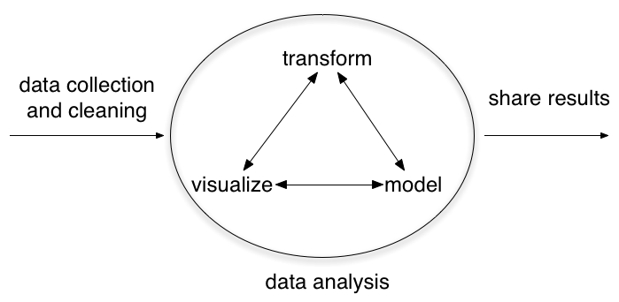

# Overview

# Review last 2 weeks

## Hypothesis testing

1. Start with a null hypothesis (H0) that represents the status quo.

2. Have an alternative hypothesis (HA) that represents our research question, i.e. what we're testing for.

3. Conduct test under assumption that the null hypothesis is true, either via simulation or traditional methods based on the central limit theorem

4. If the test results suggest that the data do not provide convincing evidence for the alternative hypothesis, we stick with the null hypothesis. If they do, then we reject the null hypothesis in favor of the alternative.

## Revisiting the $t$-distribution

- centered at 0

- bell shaped, with thicker tails than the normal model to account for more poorly estimated SE

- single parameter: **degrees of freedom** (df)

- as $df \rightarrow \infty$, $t \rightarrow Normal$

- For **ANY SAMPLE SIZE**, the sampling distribution of the mean is nearly normal for iid observations from a **nearly** normal distribution

- As sample size increases, normality becomes less and less important

## Old school: back of the book


## New school

-Remember, a p-value doesn't have to be 0.05 or 0.10

-R and other software will compute precise p-value

*Old model*

1. Select significance level

2. Find critical value

3. Compare observe test statistic to critical value

*New model*

1. Find p-value associated with critical value

2. Compare p-value to desired significance level


## Goals

After this class you will be able to 

- explain what a t-test is for and how it works
- conduct t-tests by hand and using R
- distinguish different types of t-tests 

## Where we are



# T-tests

## General question formats

1-sample t-test: Is value different from value of interested (often 0)

Paired t-test: Is there a difference between paired observations

2-sample t-test: Is there a difference between samples

# 1-sample t-test

## Example: Driving on Friday the 13th

Between 1990 - 1992 researchers in the UK collected data on traffic flow, accidents, and hospital admissions on Friday 13th and the previous Friday, Friday 6th. Below is an excerpt from this data set on traffic flow. We can assume that traffic flow on given day at locations 1 and 2 are independent.

Scanlon, T.J., Luben, R.N., Scanlon, F.L., Singleton, N. (1993), “Is Friday the 13th Bad For Your Health?”
BMJ, 307, 1584-1586.

## Goal

We want to investigate if people's behavior is different on Friday 13th compared to Friday 6th.

One approach is to compare the traffic flow on these two days.

H0: Average traffic flow on Friday 6th and 13th are equal.

HA: Average traffic flow on Friday 6th and 13th are different.

Each case in the data set represents traffic flow recorded at the same location in the same month of the same year: one count from Friday 6th and the other Friday 13th. Are these two counts independent?


## Checking assumptions

**Independence**
=We are told to assume that cases (rows) are independent.

**Sample size/skew**

-The sample distribution does not appear to be extremely skewed, but it's very difficult to assess with such a small sample size. Do we expect the population distribution to be skewed? 


## 


$\bar{x}_{diff} = 1836$ | $sd_{diff} = 1176$ | $n = 10$

## Identify test statistic

- We need critical t value for df = n - 1: $t_{df=9}$

$$t_{df} = \frac{point_estimate-null_value}{SE}$$

- Questions about why the null value is 0?

$$t_{df=9} = \frac{1836-0}{372} = 4.94$$

## Find the p-value

- the p-value corresponds to the area under the t-distribution beyond the critical value

```{r eval=FALSE}
2 * pt(4.94, df = 9, lower.tail = FALSE)
```

- multiply by 2 since this is a 2-sided test (we want area under both tables beyond the +/- t=4.94)

## We can also use the table


##


##

What is our conclusion?

Since $t_{df=9,\alpha=0.010/2} < t_{observed}$, we reject the null hypothesis and conclude that there is good evidence to support that there is a difference in traffic flow on Friday the 13th. 

## Estimating the difference

- We can use a confidence interval to estimate just what that difference is

- Remember, confidence intervals are always of the form
       point estimate +/- margin of error
       
- Margin of error is the product of critical value and SE

       $$estimate ± t_{critical} * SE$$

- For 95% CI, critical value = 2.26 (df = 9)

$$ 1836 +/- 2.26 * 372 $$
       
- We are 95% confident that on Friday 13th there are 995 to 2,677 fewer cars on the road than on the Friday 6th, on average

# Paired sample t-test

##Paired observations

Many data have a paired structure, where there is a natural correspondence between two sets of observations:

Data are "paired" wheneach observation in one set has a special
correspondence or connection with exactly one observation in the other data set.

## Example: Student writing and reading scores


##
The same students took a reading and writing test and their scores are shown below. Are the reading and writing scores of each student independent of each other?

  id   read   write
----- ------ --------
  70    57    52  
  86    44    33  
  141   63    44  
  172   47    52  
  137   63    65  

$\bar{x}_{diff} = -0.545$ | $sd_{\bar{x}_{diff}}$ = 8.887 | $n = 200$


## Analyzing paired data

-When two sets of observations have this special correspondence (not independent), they are said to be **paired**

-To analyze paired data, it is often useful to look at the difference in outcomes of each pair of observations (diff= read - write)

-It is important that we always subtract using a consistent order.

##


## Parameter vs. estimate

Parameter of interest: Average difference between the reading and writing scores of all high school students

$$ \mu_{diff} $$
    
Point estimate: Average difference between the reading and writing scores of sampled high school students

$$ \bar{x}_{diff} $$

## Hypotheses

$H_{0}$: There is no difference between the average reading and writing score

$H_{A}$: There is a difference between the average reading and writing score

Note that the hypotheses apply to $\mu_{diff}$ (population difference), not to $\bar{x}_{diff}$ (sample difference)

To see if sample difference is != 0, we just need algebra!

## Basic procedure is the same

- Compute sample average 

$$\bar{x}_{diff}$$

- Compute standard error of mean: 

$$ SE_{\bar{x}_{diff}} = \frac{sd_{diff}}{\sqrt{n_{diff}}} $$

- Compute $t_{obs}$

$$ t_{obs} = \frac{\bar{x_{diff}} - 0 }{SE_{\bar{x}_{diff}}} $$


## Compare test statistic to critical value

$$ \frac{-0.545 - 0}{\frac{8.887}{\sqrt{200}}} = -0.87 $$
```{r}
# 2 * area under curve to right of T-obs [0.87]
2 * (1-pt(-0.87,df=199,lower.tail=F))
```

Since p = `r 2 * pt(-0.87,199,lower.tail=T)`, we faill to reject null (at any plausible level of significance), and conclude that there is no good evidence to support that there is a difference in average test scores for reading and writing. 

## Back to CIs

- What if we used a confidence interval to test this hypothesis?

- How would we do so?

- What would we find?

# Two-sample t-test

## Two-sample t-test

- Same basic format as the 1-sample and paired sample test

- Compute t observed, compare to t-critical

- This time, our question format is "Is there a statistically significant difference between the means of two different samples"

- Rephrased: "Based upon the observed sample means, how likely is it that there is a TRUE difference between the population means" (remember, we just need to look to see if the samples differ!)

## Example: Diamonds

- Weights of diamonds are measured in carats

- 1 carat = 100 points, 0.99 carats = 99 points, etc

-The difference between the size of a 0.99 carat diamond and a 1 carat diamond is undetectable to the naked human eye, but does the price of a 1 carat diamond tend to be higher than the price of a 0.99 diamond?

- In order to be able to compare equivalent units, we divide the prices of 0.99 carat diamonds by 99 and 1 carat diamonds by 100, and compare the average point prices.

## Boxplot comparison
```{r results='hide',echo=FALSE,message=FALSE}
suppressPackageStartupMessages(library(ggplot2))
temp = read.csv('data/diamond.csv')
ggplot(temp) + geom_boxplot(aes(x=carat,y=ptprice)) + theme_bw() + ylab('price') + 
  scale_x_discrete(labels=c('1 carat','0.99 carat'))
```

## Sample statistics
```{r}
#sample means
tapply(temp$ptprice,temp$carat,mean)
#sample sds
tapply(temp$ptprice,temp$carat,sd)
#sample sizes
tapply(temp$ptprice,temp$carat,length)
```


## Hypotheses

$H_{0}$: Average price of 0.99 and 1.00 carat diamonds is the same

$H_{A}$: Average price of 1.00 carat diamonds is greater

- Note that this is a one-sided test!

## Parameter and point estimate

- Parameter of interest

Average difference between the point prices of **all** 0.99 carat and 1 carat diamonds.
$$\mu_{pt99} - \mu_{pt100}$$

- Estimate

Average difference between the point prices of **sampled**  0.99 carat and 1 carat diamonds.
$$\bar{x}_{pt99} - \bar{x}_{pt100}$$

## DF and SE for two samples

- Same formula for t applies: 

$$ t_{diff} = \frac{estimate - null}{SE} $$

- But:

$$ SE = \sqrt{\frac{s^{2}_{1}}{n_{1}} + \frac{s^{2}_{2}}{n_{2}}} $$

$$ df = min(n_1 - 1, n_2 - 1) $$

*Note: The calculation of the df is actually much more complicated. We'll use the above formula to estimate the true df, but in practice we'll let R do it the hard way!

##

$$t_{obs} = \frac{(44.50-53.43) - 0}{\sqrt{\frac{13.32^{2}}{23} + \frac{12.22^{2}}{30}}}$$

$$t_{obs} = -2.508$$

- Remember, we have 1-sided test (is mean same or is price of 100 carat greater?)

```{r}
#area under curve to left of -2.508
pt(-2.508,22)
```

## Test with CI:

$$(\bar{x}_{pt99} - \bar{x}_{pt1}) \pm t^\star_{df} \times SE = (44.50 - 53.43) \pm 1.72 \times 3.56$$

$$ = -8.93 \pm  6.12 $$

$$ = (-15.05, -2.81) $$

"We are 90% confident that the average price difference between a 0.99 carat diamond and a 1 carat diamond is between $2.81 to $15.05."

# Recap

## Basic t-test approach

"Assuming that the sampling distribution is normally distributed (i.e., follows the t-distribution), given the observed data is it more likely that: (A) we observe a difference but there is no population difference; or (B) we observe a difference and there is a poulation difference"

We can compare:

1. Observation to expected value (1-sample test)

2. Pairs of observation (paired-sample test)

3. Different groups (2-sample test)

## Questions?

# Goal check

