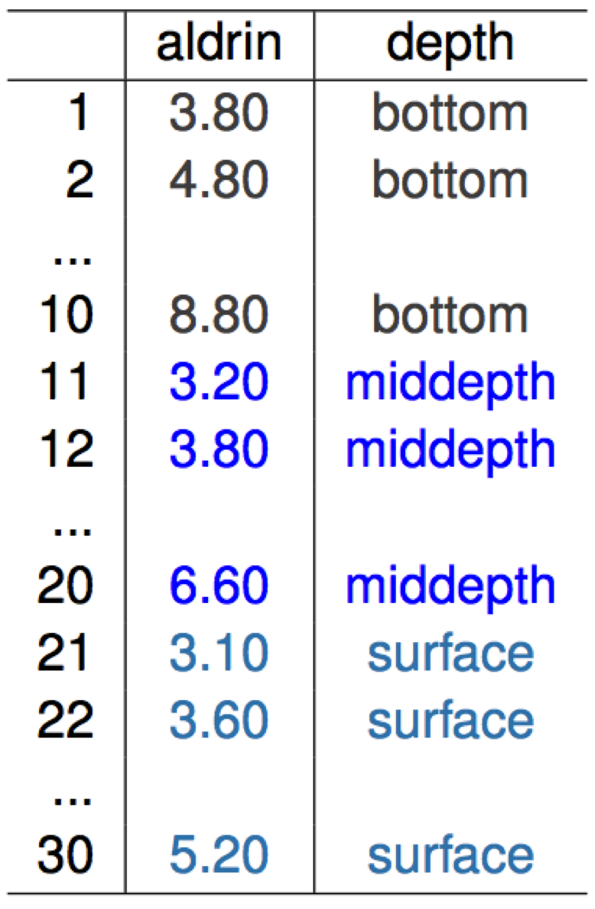
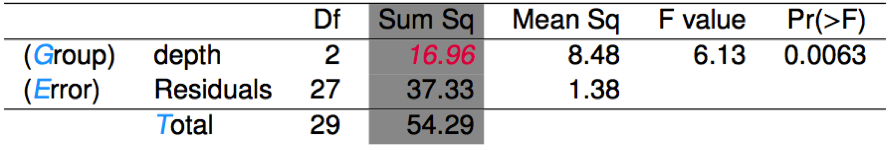
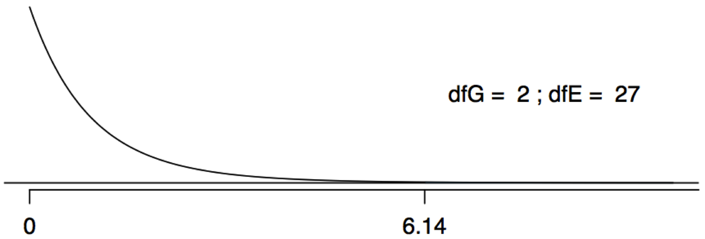
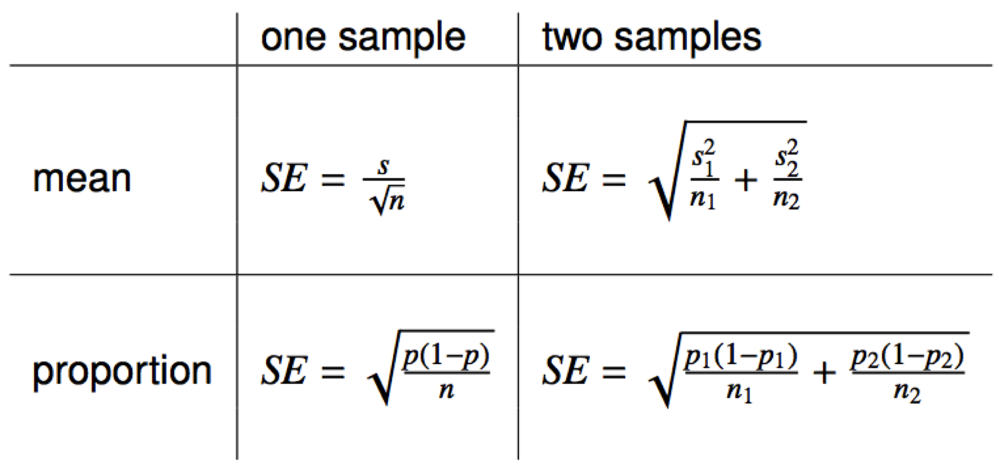
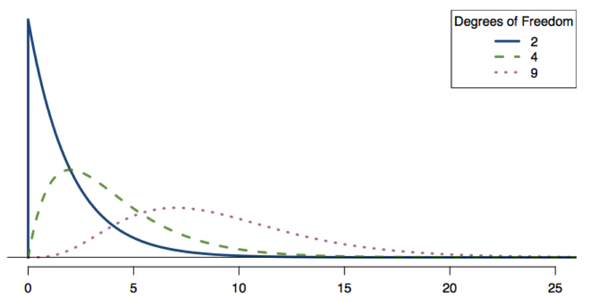
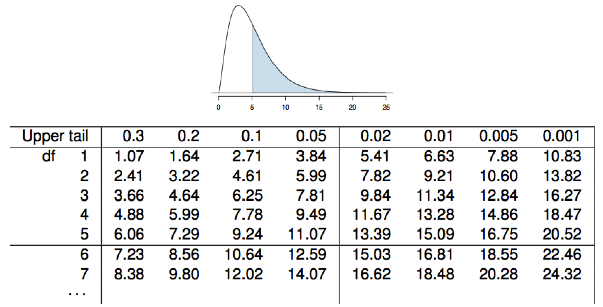

# Review

## Last week

-T-tests for comparing sample means

-For numerical data (test scores, blood pressure, species count, pollution level)

-But many policy-relevant variables are catogorical: college degrees, births, vaccinations, etc.

-Sometimes we want to compare many different groups (i.e., more than two samples)


## Where we are


# Overview

Tools for multiple means and categorical data

-ANOVA
-Pairwise comparisons
-Chi-square


## Goals

After this class you will be able to 

- explain what ANOVA and chi-square tests are used for
- sequentially employ ANOVA and multiple comparisons test to identify key group differences
- use Chi-square test to analyze independence of categorical variables

# ANOVA

## Example: Water pollution


The Wolf River in Tennessee flows past an abandoned site once used by the pesticide industry for dumping wastes, including chlordane (pesticide), aldrin, and dieldrin (both insecticides).

The standard methods to test whether these substances are present in a river is to take samples at six-tenths depth. But they are more likely to be found in higher concentrations near the bottom than near mid-depth.

## Aldrin waste



- nanograms per liter at bottom, middepth, and surface

## Exploring data

```{r results='hide',echo=FALSE,message=FALSE}
library(ggplot2);library(ggthemes)
aldrindata = read.csv('data/aldrin.csv')
ggplot(aldrindata) + geom_point(aes(x=aldrin,y=depth),col='blue',size=5) + theme_tufte(ticks=F) +
  theme(axis.text=element_text(size=12),axis.title.y=element_blank(),
        axis.title.x=element_text(size=12) )
```

Does there seem to be a difference across depth levels?

## Summary statistics

```{r eval=FALSE}
aldrindata %>% group_by(depth) %>% 
  summarise_each(funs(mean(.,na.rm=T),sd(.),n()),aldrin)
```

```{r echo=FALSE,message=FALSE,warning=FALSE}
library(dplyr)
print(aldrindata %>% group_by(depth) %>% summarise_each(funs(mean(.,na.rm=T),sd(.),n()),aldrin))
```

## Question and hypotheses

- Is there a difference between the mean aldrin concentrations among the three levels?

- $H_{0}$: There is no difference across **all** categories 

$$\mu_1  = \mu_2 = \mu_3$$

- $H_{A}$: There is at least one difference across **all** categories

$$\mu_i != \mu_{j \in G}$$

## Any key assumptions?

- Caveats about independent observations (within and between groups) still apply

- Likewise, within-group observations should be nearly normally distributed

- One more: within-group variabilty should be relatively similar across groups

## ANOVA test

-instead of t-distribution, we will use F-statistic

-Even if all groups are the same, we expect that sampling variabiltiy will produce some differences

-ANOVA (analysis-of-variance) tests whether it is reasonable to attribute observed differences to sampling variability alone

## New test statistic: F

- We will use $F$ just as we used $t$

- F-statistic: $0 <= F <= \infty$ (always positive), since F is a ratio of two values that must be >= 0

$$ F = \frac{between group variance}{w/in group variance}$$

- F-test asks "Does adding an indicator for group/category/whatever improve our ability to predict an observation?" (i.e., does grouping matter?)

## F distribution


"https://commons.wikimedia.org/wiki"

In order to be able to reject H0, we need a small p-value, which requires a large F statistic.

In order to obtain a large F statistic, variability between sample means needs to be greater than variability within sample means.

## F distribution


"https://commons.wikimedia.org/wiki"

$$df_{1} = df_{G} = k -1$$

$$df_{2} = df_{E} = n - k -1$$


## Basic intuition

- When groups differ more, F gets bigger

- When observations in same group differ more, F gets smaller

$$ F = \frac{between group variance}{w/in group variance}$$


## Intuition for F shape


"https://commons.wikimedia.org/wiki"

- As F gets bigger, it becomes easier to reject null since there is less and less area under the curve

- With more groups, having at least one difference due to randomess becomes more likely (i.e., false positive)

## ANOVA results

```{r}
summary(aov(aldrin~depth,aldrindata))
```

DF
- Groups: dfG = k - 1, where k is the number of groups
- Total: dfT = n - 1, where n is the total sample size
- Error: dfE = dfT - dfG

- dfG = k - 1 = 3 - 1 = 2
- dfT = n - 1 = 30 - 1 = 29
- dfE = 29 - 2 = 27

## What does Sum Sq (Group) mean?

Sum of squares betwen groups = $SSG$ = $\sum_{i=1}^{k}n_{i}( \bar{x}_i-\bar{x})^2$

- $n_i$ = group size, $\bar{x}_i$ = group average, and $\bar{x}$ is sample mean

## What does Sum Sq (Error) mean?

Total Sum of Squares = $TSS$ = $\sum_{i=1}^{k}n_{i}( x_i-\bar{x})^2$

- $x_i$ is every observation

If we subtract $TSS$ - $SSG$, we get $SSE$ (Sum of squares error)

## Everything in the table adds up...



- Divide Sum Sq. by Df to get Mean Sq

- Mean Sq. group / Mean Sq. error (MSE) = F statistic

## P-value for f-test




-p-value is calculated as the area under the F curve, with degrees of freedom $df_G$ and $df_E$, above the observed F statistic.

- We reject null, conclude that there is a difference (somewhere)

## Assumptions still matter

- Independence of observations ($n$<10% of population and assumption of independent units makes sense)

- At least 10 observed successes and 10 observed failures


# Pairwise comparisons

## Which groups account for our prior result?

- We could do series of t-tests

- But the more we test, the more likely we are to observe a false positive (Type I error)

- **Bonferroni correction** creates a stronger significance level that is thus more appropriate: $\alpha^* = \alpha / K$ where $K$ is the possible number of comparisons

- $K = k * (k-1) / 2$

## Modified significance level

- If we are interested in $\alpha = 0.05$, $\alpha^* = 0.05/3 = 0.0167$

T_{df_E} = \frac{(\bar{x}_{bottom} - \bar{x}_{middepth})}{\sqrt{ \frac{MSE}{n_{bottom}} + \frac{MSE}{n_{middepth}} }} 

T_{27} = \frac{( 6.04 - 5.05 )}{\sqrt{ \frac{1.38}{10} + \frac{1.38}{10} }} = \frac{0.99}{0.53}  =1.87

```{r}
2*(1-pt(1.87,27))
```

Reject bottom/middepth difference, as $p_{obs}$ > $\alpha^*$

## Comparing bottom and surface

- $\alpha^* = 0.05/3 = 0.0167$

$$T_{df_E} = \frac{(\bar{x}_{bottom} - \bar{x}_{surface})}{\sqrt{ \frac{MSE}{n_{bottom}} + \frac{MSE}{n_{surface}} }}$$

$$T_{27} = \frac{( 6.04 - 4.02 )}{\sqrt{ \frac{1.38}{10} + \frac{1.38}{10} }} = \frac{2.02}{0.53}  = 3.81$$

```{r}
2*(1-pt(3.81,27))
```

- Reject null, as $p_{obs}$ < $\alpha^*$

# Inference for proportions

## T-tests for binary outcomes

-We won't spend much time on this, as the mechanics are the same

-Major difference is that there is a different formula for SE

## $SE_{\hat{p}}

- CI is still point estimate +/- margin of error

$$ estimate +/- critical * SE$$

- SE for a proportion:

$$SE_{\hat{p}} = \sqrt{\frac{p(1-p)}{n}}$$

-since $p$ (population) is (almost always) unknow, we use $\hat{p}$

$$SE_{\hat{p}} = \sqrt{\frac{\hat{p}(1-\hat{p})}{n}}$$

## Comparing two proportions

-Comparing two proportions is just like comparing two sample means

-Remember to use different formula for $SE_{(\hat{p}_1 - \hat{p}_2)}$

$$SE_{(\hat{p}_1 - \hat{p}_2)} = \sqrt{ \frac{p_1(1-p_1)}{n_1} + \frac{p_2(1-p_2)}{n_2} }$$

## Same caveats apply

- Independence within groups ($n$<10% of population and assumption of independent units makes sense)

- At least 10 observed successes and 10 observed failures

## What is null value?

When comparing two proportions where $H_0: p_1 = p_2$, there isn't a given null value we can use to calculated the expected number of successes and failures in each sample (i.e., if we are saying they are the same, then what value do they share?)

- We need to first find a common (pooled) proportion for the two groups, and use that in our analysis.

- This simply means finding the proportion of total successes among the total number of observations.

$$\hat{p} = \frac{\#~of~successes_1 + \#~of~successes_2}{n_1 + n_2}$$

## Recap



When working with proportions...
- if doing a hypothesis test, $p$ comes from the null hypothesis
- if constructing a confidence interval, use $\hat{p}$ instead

# Goodness of Fit with Chi-Square

## Chi-square statistic

- Often, we are interested in whether observed counts within different categories differ from expected counts

- e.g., if Georgia's population is 30% black, is the student population at UGA 30% black?

- e.g., if we role a die 60,000 times, do we get 10,000 of each side?

## Hypotheses for observed counts

- $H_{0}$: Observed counts follow same distribution as expected counts

- $H_{A}$: Observed counts **do not** follow the same distribution as expected counts

- To evaluate these hypotheses, we quantify how different the observed counts are from the expected counts

- This is called a **goodness of fit** test since we're evaluating how well the observed data fit the expected distribution

## Chi-square statistic

\chi^2 = \sum_{i = 1}^k \frac{(O - E)^2}{E} \qquad \text{where $k$ = total number of cells}

Squaring the difference between the observed and the expected outcome does two things:
1. Any standardized difference that is squared will now be positive.
2. Differences that already looked unusual will become much larger after being squared.

## Chi-square distribution

- The chi-square distribution has just one parameter called degrees of freedom (df), which influences the shape, center, and spread of the distribution.

- The degrees of freedom are calculated as the number of cells (k) minus 1:

           $$df = k - 1$$

## Chi-square distribution(s)



 - As df increases, $\chi^2$ becomes more like normal distribution

##


- p-value = tail area under the chi-square distribution (as usual)
- This table works a lot like the t table, but only provides upper tail values.

## Example

There was lots of talk of election fraud in the 2009 Iran election. We'll compare the data from a poll conducted before the election (observed data) to the reported votes in the election. 

| Candidate   | Observed # | Reported % |
|-------------|------------|------------|
| Ahmedinajad | 338        | 63.29      |
| Mousavi     | 136        | 34.10      |
| Others      | 30         | 2.61       |
| Total       | 504        | 100        |


## Hypotheses

H0: The observed counts from the poll follow the same distribution as the reported votes.

HA: The observed counts from the poll do not follow the same distribution as the reported votes.

## Test statistic

| Candidate   | Observed # | Reported % |  Expected #        |
|-------------|------------|------------|--------------------|
| Ahmedinajad | 338        | 63.29      | 504 * 0.6329 = 319 |
| Mousavi     | 136        | 34.10      | 504 * 0.3410 = 172 |
| Others      | 30         | 2.61       | 504 * 0.0261 = 13  |
| Total       | 504        | 100        | 504                |

$$\frac{(338-319)^2}{319} + \frac{(136-172)^2}{172} + \frac{30-13)^2}{13} = $$
$$\chi^2_{df=3-1=2} = 30.89$$

## Conclusion

- Critical value for df=2, $\alpha=0.05$:
```{r}
qchisq(0.95,df = 2)
```

- Test statistic = 30.89

- We reject null...

## Assumptions

- same issues of independence and sample size

- in this case, each cell should have > 5 **expected** cases

- df must be > 1

## We can also test two-way table

- df as function of rows and columns
$$ df = (Rows - 1) * (Columns - 1) $$

- k = number of cells
$$ \chi^2_{df} = \sum_{i = 1}^{k} \frac{(O - E)^2}{E} $$

$$ Expected = \frac{row~total\times column~total}{table~total} $$

## Two way test of indepencence

- We often will use two-way tables to see if two factors appear to be independent (or not)

- e.g., mother who smokes and low birth weight baby

- e.g., having a Master's degree before entering PhD program and finishing PhD

## Recap

- Tools for testing proportions (t-tests), means of > 2 groups (ANOVA), and goodness-of-fit (one-way $\chi^2$) or independence (two-way $\chi^2$)

- Same basic framework applies: test statistic = (obs - exp) / variation

- These tools are the building blocks for more advanced models; these tests underlie all of the more complex work we will start doing

## Questions?

# Goal check

