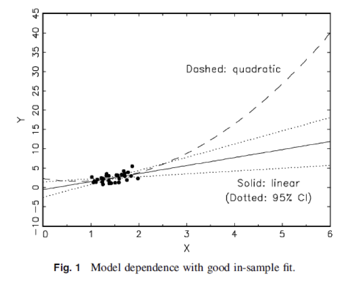

```{r setup, cache = F, echo = F, message = F, warning = F, tidy = F, results='hide'}
# make this an external chunk that can be included in any file
library(knitr)
options(width = 100)
opts_chunk$set(message = F, error = F, warning = F, comment = NA, fig.align = 'center', dpi = 100, tidy = F, cache.path = '.cache/', fig.path = 'fig/')

options(xtable.type = 'html')
knit_hooks$set(inline = function(x) {
  if(is.numeric(x)) {
    round(x, getOption('digits'))
  } else {
    paste(as.character(x), collapse = ', ')
  }
})
knit_hooks$set(plot = knitr:::hook_plot_html)
runif(1)
```


## Topics

- Ordinary least squares and linear regression
- Coefficients vs. correlation
- Inference using regression
- Extrapolation, interpolation, and prediction


## Goals

After this class you will be able to 

- explain what is a regression line and what is a residual is words, equations, and pictures
- explain the relationship between a regression coefficient and a correlation coefficent
- interpret and draw inference from slope and intercept coefficients
- compare and contrast extrapolation and interpolation 
- predict $\hat{y}^*$ and $Y^*$

This week, we are going to do this with single predictor models; next week we will do this with two predictor models.

# Overview of Regression

## Motivating example

(Simply Statistics is a blog by Jeff Leek, Roger Peng and 
Rafael Irizarry, who wrote this post, link on the image)

<a href="http://simplystatistics.org/2013/01/28/data-supports-claim-that-if-kobe-stops-ball-hogging-the-lakers-will-win-more/">
</img>
</a>

- "Data supports claim that if Kobe stops ball hogging the Lakers will win more"
- "Linear regression suggests that an increase of 1% in % of shots taken by Kobe results in a drop of 1.16 points (+/- 0.22)  in score differential."
- How was it done? Do you agree with the analysis? 


## Questions for this class
* Consider trying to answer the following kinds of questions:
  * Estimate the relationship between participation in a welfare-to-work program and holding a job
  * Estimating how a tax increase would impact consumption of good
  * Examine whether a given toxin is linked to cancer occurence
  * Predict how health care access will increase longevity
  
## Example
- As example, let's talk about the relationship between education and income.

- Here is some data from the General Social Survey.

```{r}
suppressPackageStartupMessages(library(dplyr))
load("data/gss_2010_training.RData")
gss.training <- tbl_df(gss.training)
gss <- select(gss.training, income06_n, educ, maeduc, paeduc) %>%
  filter(!is.na(income06_n), !is.na(educ), !is.na(maeduc), !is.na(paeduc))
# NOTE: DROPPING MISSING DATA LIKE THIS CAN BE DANGEROUS
gss <- rename(gss, income = income06_n)
```

## 
```{r}
suppressPackageStartupMessages(library(ggplot2))
p <- ggplot(gss, aes(x=educ, y=income))
p + geom_point() + xlab("Years of education") + ylab("Income category") +theme_bw()
```

## More data than first appears

```{r echo=FALSE}
suppressPackageStartupMessages(library(ggplot2))
```

```{r}
p <- ggplot(gss, aes(x=educ, y=income))
p + geom_jitter() + xlab("Years of education") + ylab("Income category") 
```


## Add a trendline

```{r}
p <- ggplot(gss, aes(x=educ, y=income))
p + geom_jitter() + stat_smooth(method = "lm", se = FALSE) + 
  xlab("Years of education") + ylab("Income category") 
```

## What are residuals?

```{r}
p <- ggplot(gss, aes(x=educ, y=income))
p + geom_jitter() + stat_smooth(method = "lm", se = FALSE) + 
  xlab("Years of education") + ylab("Income category")  
```

## Regression line

The regression line is the line that minimizes the sum of the squared residuals. The residual is the difference between the predicted income and actual income for each person in the sample.

$$\mbox{income}_i = \beta_0 + \beta_1 \times \mbox{educ}_i + \mbox{residual}_i$$ 

$$\widehat{\mbox{income}}_i = \beta_0 + \beta_1 \times \mbox{educ}_i $$ 


## { .smaller}
- How is this line picked instead of all the other possible lines?

```{r}
p <- ggplot(gss, aes(x=educ, y=income))
p + geom_point() + stat_smooth(method = "lm", se = F) + xlab("Years of education") + ylab("Income category") +
  geom_abline(intercept = 6, slope = 1, color = "red") +
  geom_abline(intercept = 10, slope = 0.5, color = "green")
```

- Minimize sum of squared residuals

## { .smaller}

How is this line picked instead of all the other possible types of relationships?

```{r}
p <- ggplot(gss, aes(x=educ, y=income))
p + geom_point() + xlab("Years of education") + ylab("Income category") +
  geom_smooth(data = filter(gss, educ < 12), method = "lm" , se = F, color = "blue") +
  geom_smooth(data = filter(gss, educ >= 12), method = "lm", se = F, color = "blue")
```

**Investigator choice** - our goal is to train you to make great choices!

## Regression vs. correlation

$$\hat{\beta_1} = corr(educ, income) \times \frac{SD(educ)}{SD(income)}$$

```{r}
cor(gss$income, gss$educ) * (sd(gss$income) / sd(gss$educ))
```

```{r}
library(broom)
fit <- lm(income ~ educ, data = gss)
tidy(fit)
```

- The regression coefficient is a rescaled correlation

# Ordinary least squares

## Galton's Data

* Let's use Francis Galton's data about parent/children height from 1885. 
* Galton was a statistician who invented the term and concepts
  of regression and correlation, founded the journal Biometrika,
  and was the cousin of Charles Darwin.
* Let's look at the marginal (parents disregarding children and children disregarding parents) distributions first. 
  * Correction for gender via multiplying female heights by 1.08.

## Galton: parent/child height
```{r galton,fig.height=3.5,fig.width=8,cache=TRUE,results='hide',echo=FALSE}
library(UsingR); data(galton); library(reshape); long <- melt(galton)
data(galton)
library(dplyr);
freqData <- as.data.frame(table(galton$child, galton$parent))
names(freqData) <- c("child", "parent", "freq")
freqData$child <- as.numeric(as.character(freqData$child))
freqData$parent <- as.numeric(as.character(freqData$parent))
g <- ggplot(long, aes(x = value, fill = variable)) 
g <- g + geom_histogram(colour = "black", binwidth=1) 
g <- g + facet_grid(. ~ variable)
g
```

## Finding the middle via least squares
* Consider only the children's heights. 
  * How could one describe the "middle"?
  * One definition, let $Y_i$ be the height of child $i$ for $i = 1, \ldots, n = 928$, then define the middle as the value of $\mu$
  that minimizes $$\sum_{i=1}^n (Y_i - \mu)^2$$
* This is physical center of mass of the histrogram.
* You might have guessed that the answer $\mu = \bar Y$.

## The least squares est. is the empirical mean
```{r , fig.height=4, fig.width=4, fig.align='center'}
g <- ggplot(galton, aes(x = child)) + geom_histogram(fill = "salmon", colour = "black", binwidth=1)
g <- g + geom_vline(xintercept = mean(galton$child), size = 3)
g
```

### The math (not required for the class) follows as:
$$ 
\begin{align} 
\sum_{i=1}^n (Y_i - \mu)^2 & = \
\sum_{i=1}^n (Y_i - \bar Y + \bar Y - \mu)^2 \\ 
& = \sum_{i=1}^n (Y_i - \bar Y)^2 + \
2 \sum_{i=1}^n (Y_i - \bar Y)  (\bar Y - \mu) +\
\sum_{i=1}^n (\bar Y - \mu)^2 \\
& = \sum_{i=1}^n (Y_i - \bar Y)^2 + \
2 (\bar Y - \mu) \sum_{i=1}^n (Y_i - \bar Y)  +\
\sum_{i=1}^n (\bar Y - \mu)^2 \\
& = \sum_{i=1}^n (Y_i - \bar Y)^2 + \
2 (\bar Y - \mu)  (\sum_{i=1}^n Y_i - n \bar Y) +\
\sum_{i=1}^n (\bar Y - \mu)^2 \\
& = \sum_{i=1}^n (Y_i - \bar Y)^2 + \sum_{i=1}^n (\bar Y - \mu)^2\\ 
& \geq \sum_{i=1}^n (Y_i - \bar Y)^2 \
\end{align} 
$$

## Comparing childrens' heights and their parents' heights

```{r, dependson="galton",fig.height=4,fig.width=4, fig.align='center'}
ggplot(galton, aes(x = parent, y = child)) + geom_point()
```

## Fitting the best line
* Let $Y_i$ be the $i^{th}$ child's height and $X_i$ be the 
$i^{th}$ (average over the pair of) parents' heights. 
* Consider finding the best line 
  * Child's Height = $\beta_0$ + Parent's Height $\beta_1$
* Use least squares
  $$
  \sum_{i=1}^n \{Y_i - (\beta_0 + \beta_1 X_i)\}^2
  $$
  
## Results
* The least squares model fit to the line $Y = \beta_0 + \beta_1 X$ through the data pairs $(X_i, Y_i)$ with $Y_i$ as the outcome obtains the line $Y = \hat \beta_0 + \hat \beta_1 X$ where
  $$\hat \beta_1 = Cor(Y, X) \frac{Sd(Y)}{Sd(X)} ~~~ \hat \beta_0 = \bar Y - \hat \beta_1 \bar X$$
* $\hat \beta_1$ has the units of $Y / X$, $\hat \beta_0$ has the units of $Y$.
* The line passes through the point $(\bar X, \bar Y$)
* The slope of the regression line with $X$ as the outcome and $Y$ as the predictor is $Cor(Y, X) Sd(X)/ Sd(Y)$. 
* The slope is the same one you would get if you centered the data,
$(X_i - \bar X, Y_i - \bar Y)$, and did regression through the origin.
* If you normalized the data, $\{ \frac{X_i - \bar X}{Sd(X)}, \frac{Y_i - \bar Y}{Sd(Y)}\}$, the slope is $Cor(Y, X)$.

## Revisiting Galton's data
### Double check our calculations using R
```{r, fig.height=4,fig.width=4,echo=TRUE}
y <- galton$child
x <- galton$parent
beta1 <- cor(y, x) *  sd(y) / sd(x)
beta0 <- mean(y) - beta1 * mean(x)
rbind(c(beta0, beta1), coef(lm(y ~ x)))
```


## Revisiting Galton's data
### Reversing the outcome/predictor relationship
```{r, fig.height=4,fig.width=4,echo=TRUE}
beta1 <- cor(y, x) *  sd(x) / sd(y)
beta0 <- mean(x) - beta1 * mean(y)
rbind(c(beta0, beta1), coef(lm(x ~ y)))
```


## Revisiting Galton's data
### Regression through the origin yields an equivalent slope if you center the data first
```{r, fig.height=4,fig.width=4,echo=TRUE}
yc <- y - mean(y)
xc <- x - mean(x)
beta1 <- sum(yc * xc) / sum(xc ^ 2)
c(beta1, coef(lm(y ~ x))[2])
```


## Revisiting Galton's data
### Normalizing variables results in the slope being the correlation
```{r, echo=TRUE}
yn <- (y - mean(y))/sd(y)
xn <- (x - mean(x))/sd(x)
c(cor(y, x), cor(yn, xn), coef(lm(yn ~ xn))[2])
```

# Inference and prediction

## OLS is an estimation tool, how do we do inference?

* Consider developing a probabilistic model for linear regression
$$
  Y_i = \beta_0 + \beta_1 X_i + \epsilon_{i}
$$

* $\epsilon_{i}$ are assumed iid $N(0, \sigma^2)$. 
  
* $E[Y_i ~|~ X_i = x_i] = \mu_i = \beta_0 + \beta_1 x_i$

* $Var(Y_i ~|~ X_i = x_i) = \sigma^2$.

  
## Interpretting regression coefficients
  * $\beta_0$ is the expected value of the response when the predictor is 0
$$
  E[Y | X = 0] =  \beta_0 + \beta_1 \times 0 = \beta_0
$$
  * This isn't always of interest, for example when $X=0$ is impossible or far outside of the range of data. (X is blood pressure) 
* Consider that 
$$
Y_i = \beta_0 + \beta_1 X_i + \epsilon_i
= \beta_0 + a \beta_1 + \beta_1 (X_i - a) + \epsilon_i
= \tilde \beta_0 + \beta_1 (X_i - a) + \epsilon_i
$$
So, shifting your $X$ values by value $a$ changes the intercept, but not the slope. 
* Often $a$ is set to $\bar X$ so that the intercept is interpretted as the expected response at the average $X$ value.

## Interpretting regression coefficients, the slope

* $\beta_1$ is the expected change in response for a 1 unit change in the predictor
$$
E[Y ~|~ X = x+1] - E[Y ~|~ X = x] =
\beta_0 + \beta_1 (x + 1) - (\beta_0 + \beta_1 x ) = \beta_1
$$
* Consider the impact of changing the units of $X$. 
$$
Y_i = \beta_0 + \beta_1 X_i + \epsilon_i
= \beta_0 + \frac{\beta_1}{a} (X_i a) + \epsilon_i
= \beta_0 + \tilde \beta_1 (X_i a) + \epsilon_i
$$
* Therefore, multiplication of $X$ by a factor $a$ results in dividing the coefficient by a factor of $a$. 


## Regression coefficients for prediction
* If we would like to guess the outcome at a particular
value of the predictor, say $X$, the regression model guesses
$$
Predicted~Outcome = \hat \beta_0 + \hat \beta_1 X
$$

## Interpolation and extrapolation

- Extrapolation makes predictions outside of the data
- Interpolation makes predictions inside of the data

## Extrapolation  { .smaller }



<div class="cite">
From King and Zeng (2006) [The dangers of extreme counterfactuals](http://gking.harvard.edu/files/counterft.pdf)
</div>

## Interpolation 

```{r echo=FALSE}
gss.subset <- filter(gss, educ %in% c(8, 12, 16))
p <- ggplot(gss.subset, aes(x = educ, y =income))
p + geom_point() + xlab("Years of education") + ylab("Income category") +
  geom_smooth(method = "lm" , se = F)
```

## Example
### `diamond` data set from `UsingR` 
Data is diamond prices (Singapore dollars) and diamond weight
in carats (standard measure of diamond mass, 0.2 $g$). To get the data use `library(UsingR); data(diamond)`

## Plot of the data
```{r, echo = FALSE, fig.height=5,fig.width=5}
library(UsingR)
data(diamond)
library(ggplot2)
g = ggplot(diamond, aes(x = carat, y = price))
g = g + xlab("Mass (carats)")
g = g + ylab("Price (SIN $)")
g = g + geom_point(size = 7, colour = "black", alpha=0.5)
g = g + geom_point(size = 5, colour = "blue", alpha=0.2)
g = g + geom_smooth(method = "lm", colour = "black")
g
```


## Fitting the linear regression model
```{r}
fit <- lm(price ~ carat, data = diamond)
coef(fit)
```

* We estimate an expected `r round(coef(fit)[2], 2)` (SIN) dollar increase in price for every carat increase in mass of diamond.
* The intercept `r round(coef(fit)[1], 2)` is the expected price
  of a 0 carat diamond.


## Getting a more interpretable intercept
```{r, echo = TRUE}
fit2 <- lm(price ~ I(carat - mean(carat)), data = diamond)
coef(fit2)
```

Thus $`r round(coef(fit2)[1], 1)` is the expected price for 
the average sized diamond of the data (`r mean(diamond$carat)` carats).


## Changing scale
* A one carat increase in a diamond is pretty big, what about
  changing units to 1/10th of a carat? 
* We can just do this by just dividing the coeficient by 10.
  * We expect  a `r round(coef(fit)[2], 2) / 10` (SIN) dollar   change in price for every 1/10th of a carat increase in mass of diamond.
* Showing that it's the same if we rescale the Xs and refit
```{r, echo = TRUE}
fit3 <- lm(price ~ I(carat * 10), data = diamond)
coef(fit3)
```


## Predicting the price of a diamond
```{r, echo = TRUE}
newx <- c(0.16, 0.27, 0.34)
coef(fit)[1] + coef(fit)[2] * newx
predict(fit, newdata = data.frame(carat = newx))
```

##
Predicted values at the observed Xs (red)
and at the new Xs (lines)
```{r, echo = FALSE, fig.height=5,fig.width=5}
data(diamond)
plot(diamond$carat, diamond$price,  
     xlab = "Mass (carats)", 
     ylab = "Price (SIN $)", 
     bg = "lightblue", 
     col = "black", cex = 1.1, pch = 21,frame = FALSE)
abline(fit, lwd = 2)
points(diamond$carat, predict(fit), pch = 19, col = "red")
lines(c(0.16, 0.16, 0.12), 
      c(200, coef(fit)[1] + coef(fit)[2] * 0.16,
      coef(fit)[1] + coef(fit)[2] * 0.16))
lines(c(0.27, 0.27, 0.12), 
      c(200, coef(fit)[1] + coef(fit)[2] * 0.27,
        coef(fit)[1] + coef(fit)[2] * 0.27))
lines(c(0.34, 0.34, 0.12), 
      c(200, coef(fit)[1] + coef(fit)[2] * 0.34,
        coef(fit)[1] + coef(fit)[2] * 0.34))
text(newx, rep(250, 3), labels = newx, pos = 2)
```


# Intervals for $\hat{y}^*$ and $Y^*$

## A note on notation

- Capital letters are random variables (e.g. $X$ and $Y$) while lower case letters
are the values that those variables have taken.
- If the $x$ or the $y$ has a subscript, it's referring to that coordinate of one
of the observations.  e.g. $x_i$, $x_n$.
- If it has a hat, that means it's an estimate.  e.g. $\hat{y}_i$, $\hat{\beta}_1$.
- If it has an asterisk, that means it's a new specific value that's not in the 
data set. e.g. $x^*$.

- What does $\hat{y}^*$ mean?
- What does $Y^*$ mean?

## Considering a single data set

```{r, echo=FALSE}
plot(20, 25, xlim = c(12, 28), ylim = c(17, 35), ylab = "y", xlab = "x", type = "n") # set up an empty plot
set.seed(447)
n <- 60
beta_0 <- 12
beta_1 <- .7
sigma <- 2
x <- rnorm(n, mean = 20, sd = 3)
f_mean <- beta_0 + beta_1 * x # mean function
f_data <- f_mean + rnorm(n, mean = 0, sd = sigma) # data generating function
points(x, f_data, pch = 16, col = rgb(70/255, 130/255, 180/255, 1)) # add generated data
m1 <- lm(f_data~x)
abline(m1, lwd = 2, col = "darkgreen")
text(27, 32, expression(hat(y)))
```

## Interval for $\hat{y}^*$

What value would we predict for a new $x^*$?

\[ \hat{y}^* = \hat{\beta}_0 + \hat{\beta}_1 * x^* \]

```{r, echo=FALSE}
plot(20, 25, xlim = c(12, 28), ylim = c(17, 35), ylab = "y", xlab = "x", type = "n") # set up an empty plot
points(x, f_data, pch = 16, col = rgb(70/255, 130/255, 180/255, 1)) # add generated data
abline(m1, lwd = 2, col = "darkgreen")
lines(c(24, 24), c(17, 35), lty = 2, col = "darkgrey")
text(27, 32, expression(hat(y)))
text(25, 20, "x* = 24")
lines(c(12, 28), rep(m1$coef[1] + m1$coef[2] * 24, 2), lty = 2, col = "darkgrey")
text(13, m1$coef[1] + m1$coef[2] * 24 + 1, expression(paste(hat(y)[textstyle("*")])))
```


## Interval for $\hat{y}^*$ 

How much uncertainty do we have in that prediction?

\[ \hat{y}^* = \hat{\beta}_0 + \hat{\beta}_1 * x^* \]

Two sources of uncertainty:

1. estimating $\beta_0$
2. estimating $\beta_1$

We can calculate $SE(\hat{y}^*)$:

\[ S \sqrt{\frac{1}{n} + \frac{(x^* - \bar{x})^2}{SXX}}  \]


## Interval for $\hat{y}^*$ {.build}

We know that $\hat{y}^*$ will also be  t-distributed, so we can form a CI:

\[ \hat{y}^* \pm t * SE(\hat{y}^*) \]

```{r}
m1 <- lm(f_data~x)
x_star <- 24
m1$coef[1] + m1$coef[2] * x_star
predict(m1, data.frame(x = x_star), interval = "confidence")
```


## Interval for $\hat{y}^*$

```{r, echo=FALSE}
plot(20, 25, xlim = c(12, 28), ylim = c(17, 35), ylab = "y", xlab = "x", type = "n") # set up an empty plot
points(x, f_data, pch = 16, col = rgb(70/255, 130/255, 180/255, 1)) # add generated data
abline(m1, lwd = 2, col = "darkgreen")
lines(c(24, 24), c(17, 35), lty = 2, col = "darkgrey")
text(27, 32, expression(hat(y)))
text(25, 20, "x* = 24")
lines(c(12, 28), rep(m1$coef[1] + m1$coef[2] * 24, 2), lty = 2, col = "darkgrey")
text(13, m1$coef[1] + m1$coef[2] * 24 + 1, expression(paste(hat(y)[textstyle("*")])))
ci <- predict(m1, data.frame(x = x_star), interval = "confidence")
points(x_star, ci[1], col = "green", pch = 16)
lines(rep(x_star, 2), ci[2:3], col = "green", lwd = 2)
lines(c(x_star - .3, x_star + .3), rep(ci[2], 2), col = "green")
lines(c(x_star - .3, x_star + .3), rep(ci[3], 2), col = "green")
```


## 

Consider the SE term:

\[ SE(\hat{y}^*) =  S \sqrt{\frac{1}{n} + \frac{(x^* - \bar{x})^2}{SXX}}  \]

For what values of $x^*$ would you expect the interval for $\hat{y}^*$ to be the
narrowest?


##

```{r, echo=FALSE}
plot(20, 25, xlim = c(12, 28), ylim = c(17, 35), ylab = "y", xlab = "x", type = "n") # set up an empty plot
points(x, f_data, pch = 16, col = rgb(70/255, 130/255, 180/255, 1)) # add generated data
abline(m1, lwd = 2, col = "darkgreen")
xx <- seq(12, 28, .2)
int_mat <- predict(m1, data.frame(x = xx), interval = "confidence")
lines(xx, int_mat[, 2], lty = 2, col = "darkgreen")
lines(xx, int_mat[, 3], lty = 2, col = "darkgreen")
lines(c(24, 24), c(17, 35), lty = 2, col = "darkgrey")
text(25, 20, "x* = 24")
ci <- predict(m1, data.frame(x = x_star), interval = "confidence")
points(x_star, ci[1], col = "green", pch = 16)
lines(rep(x_star, 2), ci[2:3], col = "green", lwd = 2)
lines(c(x_star - .3, x_star + .3), rep(ci[2], 2), col = "green")
lines(c(x_star - .3, x_star + .3), rep(ci[3], 2), col = "green")
```

Look familiar?


## Prediction interval for $Y^*$ {.build}

$Y^*$ represents the *actual values* that you might be observed in the y.  This comes not
from the estimated mean function:

\[ \hat{y} = \hat{\beta}_0 + \hat{\beta}_1 * x \]

But from the estimated data generating function:

\[ Y = \hat{\beta}_0 + \hat{\beta}_1 * x + e\]

Which has *three* sources of uncertainty:

1. estimating $\beta_0$.
2. estimating $\beta_1$.
3. the random error $e$.


## Prediction interval for $Y^*$ {.build}

The SE for the CI:

\[ SE(\hat{y}^*) =  S \sqrt{\frac{1}{n} + \frac{(x^* - \bar{x})^2}{SXX}}  \]

gains an extra term for the PI:

\[ SE(Y^*) =  S \sqrt{1 + \frac{1}{n} + \frac{(x^* - \bar{x})^2}{SXX}}  \]


## Prediction interval for $Y^*$ {.build}

What is the 95% prediction interval for $x^* = 24$?

\[ \hat{y}^* \pm t * SE(Y^*) \]

```{r}
m1 <- lm(f_data~x)
x_star <- 24
m1$coef[1] + m1$coef[2] * x_star
predict(m1, data.frame(x = x_star), interval = "prediction")
```


## Prediction interval for $Y^*$

```{r, echo=FALSE}
plot(20, 25, xlim = c(12, 28), ylim = c(17, 35), ylab = "y", xlab = "x", type = "n") # set up an empty plot
points(x, f_data, pch = 16, col = rgb(70/255, 130/255, 180/255, 1)) # add generated data
abline(m1, lwd = 2, col = "darkgreen")
lines(c(24, 24), c(17, 35), lty = 2, col = "darkgrey")
text(27, 32, expression(hat(y)))
text(25, 20, "x* = 24")
lines(c(12, 28), rep(m1$coef[1] + m1$coef[2] * 24, 2), lty = 2, col = "darkgrey")
text(13, m1$coef[1] + m1$coef[2] * 24 + 1, expression(paste(hat(y)[textstyle("*")])))
pi <- predict(m1, data.frame(x = x_star), interval = "prediction")
lines(rep(x_star, 2), pi[2:3], col = "violetred", lwd = 2)
lines(c(x_star - .3, x_star + .3), rep(pi[2], 2), col = "violetred", lwd = 2)
lines(c(x_star - .3, x_star + .3), rep(pi[3], 2), col = "violetred", lwd = 2)
ci <- predict(m1, data.frame(x = x_star), interval = "confidence")
points(x_star, ci[1], col = "green", pch = 16)
lines(rep(x_star, 2), ci[2:3], col = "green", lwd = 2)
lines(c(x_star - .3, x_star + .3), rep(ci[2], 2), col = "green")
lines(c(x_star - .3, x_star + .3), rep(ci[3], 2), col = "green")
```


## Comparing intervals

```{r, echo=FALSE}
plot(20, 25, xlim = c(12, 28), ylim = c(17, 35), ylab = "y", xlab = "x", type = "n") # set up an empty plot
points(x, f_data, pch = 16, col = rgb(70/255, 130/255, 180/255, 1)) # add generated data
abline(m1, lwd = 2, col = "darkgreen")
ci_mat <- predict(m1, data.frame(x = xx), interval = "confidence")
lines(xx, ci_mat[, 2], lty = 2, col = "darkgreen")
lines(xx, ci_mat[, 3], lty = 2, col = "darkgreen")
pi_mat <- predict(m1, data.frame(x = xx), interval = "prediction")
lines(xx, pi_mat[, 2], lty = 2, col = "violet")
lines(xx, pi_mat[, 3], lty = 2, col = "violet")
legend(24, 21.5, legend = c("CI", "PI"), col = c("darkgreen", "violet"),
       lty = 2, lwd = 2, bty = "n")
```

# wrap-up

## 

Questions?

## 

Goal check

## 

motivation for next class

##
```{r}
sessionInfo()
```

