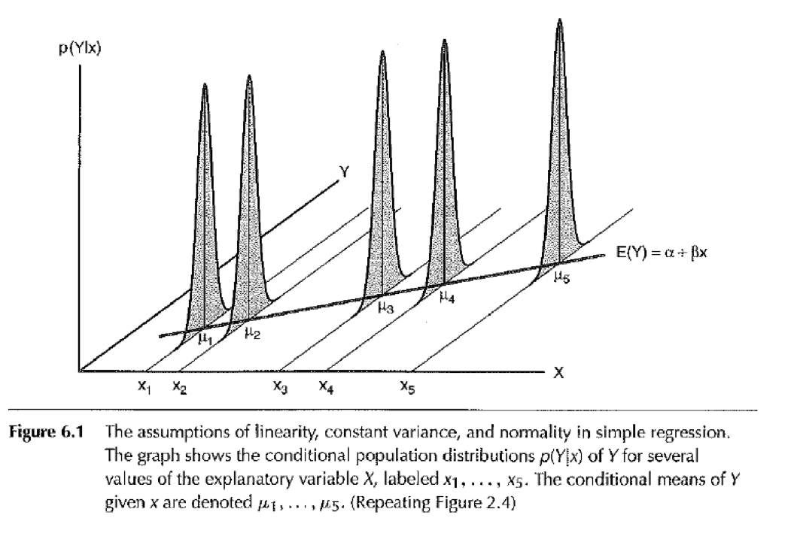

```{r setup, cache = F, echo = F, message = F, warning = F, tidy = F, results='hide'}
# make this an external chunk that can be included in any file
library(knitr)
options(width = 100)
opts_chunk$set(message = F, error = F, warning = F, comment = NA, fig.align = 'center', dpi = 100, tidy = F, cache.path = '.cache/', fig.path = 'fig/')

options(xtable.type = 'html')
knit_hooks$set(inline = function(x) {
  if(is.numeric(x)) {
    round(x, getOption('digits'))
  } else {
    paste(as.character(x), collapse = ', ')
  }
})
knit_hooks$set(plot = knitr:::hook_plot_html)
runif(1)
```

## Topics

- Regression assumptions
- Diagnostics
- Leverage and outliers

## Goals

After this class you will be able to 

- identify and evaluate key regression assumptions
- describe the difference between empirical and structural relationships
- explain the consequences of measurement error on the outcome variable and predictor variables
- identify and characterize impact of outliers


## Motivating Example { .smaller}

Anscombe's (1973) (`data(anscombe)`) four data sets have the same mean, variance, correlation, regression line, etc. $R^2 \approx 0.66$ in every case!

```{r, echo=FALSE}
m1 <- lm(y1 ~ x1, data = anscombe)

ff <- y ~ x
mods <- setNames(as.list(1:4), paste0("lm", 1:4))
for(i in 1:4) {
  ff[2:3] <- lapply(paste0(c("y","x"), i), as.name)
  mods[[i]] <- lmi <- lm(ff, data = anscombe)
}
op <- par(mfrow = c(2, 2), mar = 0.1+c(4,4,1,1), oma =  c(0, 0, 2, 0))
for(i in 1:4) {
  ff[2:3] <- lapply(paste0(c("y","x"), i), as.name)
  plot(ff, data = anscombe, col = "red", pch = 21, bg = "orange", cex = 1.2,
       xlim = c(3, 19), ylim = c(3, 13))
  abline(mods[[i]], col = "blue")
}
par(op)
```

  
  
## Avoid the Danger Zone!

<center>  <center>

<div class="cite" >
http://drewconway.com/zia/2013/3/26/the-data-science-venn-diagram
</div>


# Assumptions

## What regression assumes...

Data generating process:
$$Y_i = \alpha + \beta X_i + \epsilon_i$$

Given lots of pairs $(x, y)$ what we can infer about $\alpha$ and $\beta$?  Such inference requires a series of assumptions...

## For a valid model we need...

1. The conditional mean of Y|X is a linear function of X.
2. The variance of Y|X is the same for any X.
3. The errors (and thus the Y|X are independent of one another).
4. The errors are normally distributed with mean zero.
5*. No "outliers".

## ... which lead to variety of properties

- unbiased estimators
- specific sampling variance
- most efficent of all linear estimators
- maximum liklihood estimators
- coefficents are normally distributed

##

<center></center>

<div class="cite">
[Fox 2008](http://socserv.socsci.mcmaster.ca/jfox/Books/Applied-Regression-2E/index.html), Figure 6.1
</div>

## 

Consider the case:

$$Y_i = \beta_0 + \beta_1 X_i + \epsilon_i$$

Most assumptions are about relationship between $X$ and $\epsilon$.

And, these can be checked (mainly by residual plots)...

## Basic residual plots

We will use `m1 <- lm(y1 ~ x1, data = anscombe)`

How to construct residual plot:

1. Calculate $\hat{e}_i = y_i - \hat{y}_i$ for each point in your data set (also
available as `m1$res`).
2. Create a scatter plot with the residuals on the y axis.  On the x-axis you
can plot either the x-coordinates or the fitted values (\hat{y}_i).

```{r, eval=FALSE}
plot(anscombe$x1, m1$res) # x versus residuals
plot(m1$fit, m1$res) # x versus fitted
plot(m1, 1) # built-in function
```

## Residual vs. X for each dataset

```{r, echo=FALSE}
ff <- y ~ x
mods <- setNames(as.list(1:4), paste0("lm", 1:4))
for(i in 1:4) {
  ff[2:3] <- lapply(paste0(c("y","x"), i), as.name)
  mods[[i]] <- lmi <- lm(ff, data = anscombe)
}
op <- par(mfrow = c(2, 2), mar = 0.1+c(4,4,1,1), oma =  c(0, 0, 2, 0))
for(i in 1:4) {
  plot(mods[[i]], 1)
  #ff[2:3] <- lapply(paste0(c("y","x"), i), as.name)
  #plot(ff, data = anscombe, col = "red", pch = 21, bg = "orange", cex = 1.2,
  #     xlim = c(3, 19), ylim = c(3, 13))
  #abline(mods[[i]], col = "blue")
}
par(op)

```


## Anscombe I { .smaller}
1. The conditional mean of Y|X is a linear function of X. *OK!*
2. The variance of Y|X is the same for any X. *OK!*
3. The errors (and thus the Y|X are independent of one another). *OK!*
4. The errors are normally distributed with mean zero. *Probably ok?*
5. No "outliers". *OK!*
```{r echo=FALSE,fig.height=4}
plot(mods[[1]], 1)
```

## Anscombe II { .smaller}
1. The conditional mean of Y|X is a linear function of X. *Looks quadratic*
2. The variance of Y|X is the same for any X. *OK!*
3. The errors (and thus the Y|X are independent of one another).
*Could be an issue, but probably not.*
4. The errors are normally distributed with mean zero.
*Looks unlikely*
5. No "outliers".*8 and 6 maybe?*
```{r echo=FALSE,fig.height=4}
plot(mods[[2]], 1)
```

## Anscombe III { .smaller}
1. The conditional mean of Y|X is a linear function of X.
*Perfectly linear, but we've fit the wrong line!*
2. The variance of Y|X is the same for any X.
*Looks like a problem.*
3. The errors (and thus the Y|X are independent of one another).
*Hard to tell.*
4. The errors are normally distributed with mean zero.
*Hard to tell.*
5. No "outliers".
*Whoops!  Point 3 is a glaring problem.*
```{r echo=FALSE,fig.height=4}
plot(mods[[3]], 1)
```


## Anscombe IV { .smaller}
1. The conditional mean of Y|X is a linear function of X.
*Possibly, though the X doesn't appear to have much predictive power.*
2. The variance of Y|X is the same for any X.
*Hard to say.*
3. The errors (and thus the Y|X are independent of one another).
*Hard to tell.*
4. The errors are normally distributed with mean zero.
*Looks more uniform.*
5. No "outliers".
*The slope of the line is being completely determined by one point!*
```{r echo=FALSE,fig.height=4}
plot(mods[[4]], 1)
```

## Assessing Normality 

We can check the assumption that the errors are normal by looking at the distribution
of the residuals.  Difficult to do in a residual plot, so we use a QQ plot (for
quantile-quantile), aka normal probability plot.

*Quantile*: The $j^{th}$ quantile, $q_j$, is the value of a random variable $X$ 
that fulfills:

\[ P(X \le q_j) = j \]

For the standard normal distribution, $q_{.5} = 0$, $q_{.025} = -1.96$, 
$q_{.975} = 1.96$.


## Constructing a QQ plot 

1. Standardize your residuals.
\[ \tilde{e}_i = \frac{\hat{e}_i - \bar{\hat{x}}}{s} \]

2. If you have $n$ standardized residuals, you can consider the lowest to be
the $1/n$ quantile, the second lowest, the $2/n$ quantile, the median to be the
$.5$ quantile, etc.

3. Look up these values for the standard normal distribution and find what the 
appropriate quantiles would be (this is what `qnorm()` does). These become your 
theoretical quantiles.

4. Plot the theoretical quantiles against the standardized residuals.


## Constructing a QQ plot {.build}

1. Standardize your residuals.
\[ \tilde{e}_i = \frac{\hat{e}_i - \bar{\hat{x}}}{s} \]

2. If you have $n$ standardized residuals, you can consider the lowest to be
the $1/n$ quantile, the second lowest, the $2/n$ quantile, the median to be the
$.5$ quantile, etc.

3. Look up these values for the standard normal distribution and find what the 
appropriate quantiles would be (this is what `qnorm()` does). These become your 
theoretical quantiles.

4. Plot the theoretical quantiles against the standardized residuals.


##

```{r, fig.height=5, fig.width = 5, fig.align='center'}
plot(m1, 2)
```


## Interpreting a QQ plot

- Perfectly normally distributed residuals would align along the identify line.
- Short tails will veer of the line horizontally.
- Long tails will veer off the line vertically.
- *Expect some variation, even from normal residuals!*


## Normal residuals

```{r fig.height=5, fig.width = 5, fig.align='center'}
x <- rnorm(40)
qqnorm(x)
qqline(x)
```


## Heavy tailed residuals

```{r fig.height=5, fig.width = 5, fig.align='center'}
x <- rt(40, 1)
qqnorm(x)
qqline(x)
```


## Returning to Anscome 1

```{r echo=FALSE}
par(mfrow = c(1, 2))
plot(m1, 1:2)
```


## Checking constant variance

Example: We will use R's `quakes` data set, which gives the locations of 1000 seismic events of MB > 4.0 occuring near Fiji since 1964.

```{r}
data(quakes)
head(quakes)
```

We will model the number of stations reporting the quake (`quakes$stations`) as a function of magnitude (`quakes$mag`).

## Fiji quakes data

```{r, echo=FALSE}
par(mfrow=c(1,1))
plot(stations ~ mag, data = quakes)
m1 <- lm(stations ~ mag, data = quakes)
text(x=6.0,y=40,expression(hat(y) == -180.42 + 46.28*x))
abline(m1, col = "orange")  
```

##

```{r, echo=FALSE}
par(mfrow = c(2, 1))
plot(m1, 1:2)
```

## 
```{r fig.height=5, fig.width = 5, fig.align='center'}
par(mfrow=c(1,1))
plot(m1, 3)
```


## Checking constant variance 

- The scale location plot transforms the residuals to make non-constant
variance (heteroscedasticity) more apparent.
- The red line is a guide: flat = constant variance.
- The basic residual plot can also be used, but it's a bit more difficult to tell
(also, *that* red line refers to the linear trend).


# Outliers and Leverage

```{r echo=FALSE,message=FALSE,results='hide',warning=FALSE}
library(openintro)
COL <- c('#55000088','#225588')
set.seed(238)
n <- c(50, 25, 78, 55, 70, 150)
m <- c(12, -4, 7, -19, 0, 40)
xr <- list(0.3, c(2), 1.42, runif(4,1.45,1.55), 5.78, -0.6)
yr <- list(-4, c(-8), 19, c(-17,-20,-21,-19), 12, -23.2)
i <- 1
x <- runif(n[i])
y <- m[i]*x + rnorm(n[i])
x <- c(x,xr[[i]])
y <- c(y,yr[[i]])
```

## Outliers, leverage, influence

**Outliers** are points that don't fit the trend in the rest of the data.

Calling a point an outlier is vague. 
  * Outliers can be the result of spurious or real processes.
  * Outliers can have varying degrees of influence.
  * Outliers can conform to the regression relationship (i.e being marginally outlying in X or Y, but not outlying given the regression relationship).
  
  
## Leverage and (possibly) influence

**Leverage** measures the weight given to each point in determining the regression
line.. **High leverage points** have the potential to have an unusually large influence on the fitted model.

**Influence** measures how different the regression line would be without a given
point. **Influential points** are high leverage points that cause a very different
line to be fit than would be with that point removed.
  
- Being high-leverage is a necessary condition for being highly influential  


## High leverage, low influence

```{r, echo=FALSE}
set.seed(12)
i <- 2
x <- runif(n[i])
y <- m[i]*x + rnorm(n[i])
x <- c(x,xr[[i]])
y <- c(y,yr[[i]])
y <- y - mean(y)
par(mar=c(4,4,1,1), las=1, mgp=c(2.5,0.5,0), cex.lab = 1.25, cex.axis = 1.25, mfrow = c(2,1))
lmPlot(x, y, col = COL[2], lCol = COL[1], lwd = 3)
```

## High leverage, high influence
We can data on the surface temperature and light intensity of 47 stars in the
star cluster CYG OB1, near Cygnus (`library(faraway);data(start)`).
```{r, echo=FALSE}
library(faraway)
data(star)
par(mar=c(4,4,2,1), las=1, mgp=c(2.5,0.7,0), cex.lab = 1.25, cex.axis = 1.25)
plot(light ~ temp, data = star, pch=19, col=COL[2], xlab = "log(temp)", ylab = "log(light intensity)")
abline(lm(light~temp, data = star), col = "darkgreen", lwd = 3, lty = 2)
abline(lm(light[temp>4]~temp[temp>4], data = star), col = COL[1], lwd = 3)
legend("top", inset = 0.05, c("w/ outliers","w/o outliers"), lty = c(2,1), lwd = c(2,3), col = c("darkgreen",COL[1]))
```

## High Influence

```{r, echo=FALSE, fig.height=4, }
i <- 5
x <- runif(n[i])
y <- m[i]*x + rnorm(n[i])
x <- c(x,xr[[i]])
y <- c(y,yr[[i]])
par(mfrow = c(1, 2))
plot(x, y, col = COL[2], pch = 16)
abline(lm(y ~ x), col = COL[1], lwd = 3)
x2 <- x[1:70]
y2 <- y[1:70]
plot(x2, y2, col = COL[2], pch = 16, xlim = range(x), ylim = range(y))
abline(lm(y2 ~ x2), col = COL[1], lwd = 3)
```

## {.smaller}
```{r, fig.height = 4, fig.width=5, echo = FALSE, results='hide'}
n <- 100; x <- rnorm(n); y <- x + rnorm(n, sd = .3)
plot(c(-3, 6), c(-3, 6), type = "n", frame = FALSE, xlab = "X", ylab = "Y")
abline(lm(y ~ x), lwd = 2)
points(x, y, cex = 2, bg = "lightblue", col = "black", pch = 21)
points(0, 0, cex = 2, bg = "darkorange", col = "black", pch = 21)
points(0, 5, cex = 2, bg = "darkorange", col = "black", pch = 21)
points(5, 5, cex = 2, bg = "darkorange", col = "black", pch = 21)
points(5, 0, cex = 2, bg = "darkorange", col = "black", pch = 21)
```
  
* Upper left: low leverage, low influence, outlies in a way not conforming regression relationship.
* Lower left: low leverage, low influence and is not to be an outlier in any sense.
* Upper right: high leverage, but chooses not to extert it and would have low actual influence by conforming to the regression relationship
* Lower right hand point has high leverage and (if included) high influence

## Quantifying leverage: $h_{ii}$
We need a metric for the leverage of $x_i$ that incorporates

1. The distance $x_i$ is away from the bulk of the $x$'s.
2. The extent to which the fitted regression line is attracted by the given point.

\[ h_{ii} = \frac{1}{n} + \frac{(x_i - \bar{x})^2}{\sum_{j = 1}^n(x_j - \bar{x})^2} \]

## What is "high" leverage?

**Rule of Thumb**: in simple regression, a point has "high leverage" if
$h_{ii} > 4/n$.

```{r, fig.height=3.5, echo=1:2}
m1 <- lm(y ~ x)
h <- lm.influence(lm(y ~ x))$hat
hist(h)
abline(v = 4/length(y), col = "red")
```


## Quantifying influence in R

  * `rstandard` - standardized residuals, residuals divided by their standard deviations)
  * `rstudent` - standardized residuals, residuals divided by their standard deviations, where the ith data point was deleted in the calculation of the standard deviation for the residual to follow a t distribution
  * `hatvalues` - measures of leverage
  * `dffits` - change in the predicted response when the $i^{th}$ point is deleted in fitting the model.
  * `dfbetas` - change in individual coefficients when the $i^{th}$ point is deleted in fitting the model.
  * `cooks.distance` - overall change in coefficients when the $i^{th}$ point is deleted.


## Standardized residuals

To be sure all of our residuals are assessed on equal footing, we divide each one
by our estimate of it's standard deviation.

\[ r_i = \frac{\hat{e}}{s \sqrt{1 - h_{ii}}} \]

Where $s$ is our usual estimate of $\sigma$.

Observations with high standardized residuals can be considered *outliers*. Rule
of thumb: $|r_i| > 2$ for small data, $|r_i| > 4$ for large.


## Why standardize?

We will need to assess whether the assumption of errors with constant variance 
is reasonable.

What if the non-constant variance that we observe isn't a property of the *errors*
but the non-constant variance that goes into making the prediction from which the
*residuals* are calculated?


# Recap

## Summary

* Residual QQ plots investigate normality of the errors.
* Leverage measures (hat values) can be useful for diagnosing data entry errors.
* Influence measures get to the bottom line, 'how does deleting or including this point impact a particular aspect of the model'.


## Always do residual plots
* Patterns in your residual plots generally indicate some poor aspect of model fit. These can include:
* Heteroskedasticity (non constant variance).
* Missing model terms.
* Temporal patterns (plot residuals versus collection order).

## How do I use all of these things?
* Understand what diagnostic tools are trying to accomplish and use them judiciously.
* Not all of the measures have meaningful absolute scales. You can look at them relative to the values across the data.
* They probe your data in different ways to diagnose different problems.

## Main goal: think differently

How you might have thought before:

- your p-values = f(your data)

How I hope you think now:

- your p-values = f(your data, your assumptions)

# wrap-up

## Questions?

##

Goal check

##


