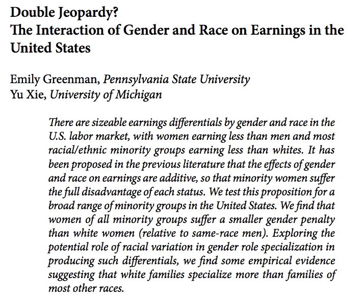
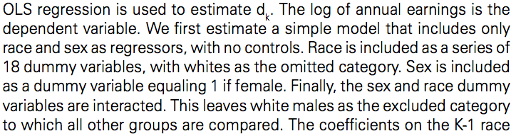
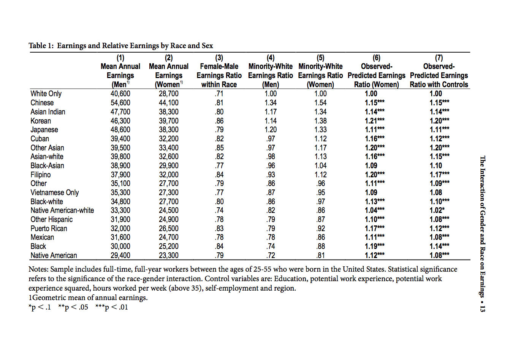
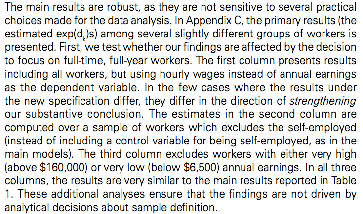
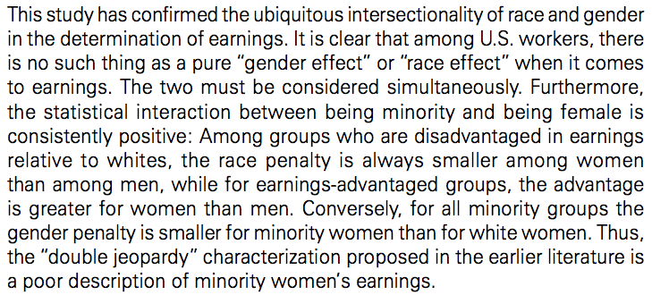

## Topics

So far, we have focused on regression involving linear coefficients for numeric independent variables. Today, we turn our attention to new classes of regression terms:

- "dummy" variables
- categorical variables
- interactions


## Goals

After class today you will be able to 

- illustrate regression with dichotomous dummy variables in words, pictures, and equations
- illustrate regression with polytomous dummy variables in words, pictures, and equations
- illustrate regressions with interactions between a continuous variable and a dummy variable in words, pictures, and equations
- identify substantive research questions that involve dummy variables and interactions
- match theoretical models to interaction models
- explain why it is important to include constitutive terms in a model with interactions
- interpret models with interactions between dichotomous and continuous variables


# dummy variables

##

We are going to be looking at the relationship between years of education and vocabulary.  This data is originally from the GSS, and is obtained from [John Fox's website](http://socserv.socsci.mcmaster.ca/jfox/Books/Applied-Regression-2E/datasets/index.html).


```{r echo=FALSE,message=FALSE,warning=FALSE}
library(dplyr)
library(ggplot2);library(ggthemes)
library(broom)
```

##

```{r}
data <- read.table("data/Vocabulary.txt", header=TRUE)
data <- tbl_df(data)
p <- ggplot(data, aes(x=education, y=vocabulary))
p + geom_jitter() + stat_smooth(method = "lm") + theme_bw()
```

##

```{r}
p <- ggplot(data, aes(x=education))
p + geom_histogram(binwidth=1, colour="black", fill="dark grey", origin = -0.5) +
  scale_x_continuous(breaks=0:20) + theme_bw() + facet_grid(sex ~ .) 
```

##

```{r}
p <- ggplot(data, aes(x=vocabulary))
p + geom_histogram(binwidth=1, colour="black", fill="white", origin = -0.5) +
  scale_x_continuous(breaks=0:10) + facet_grid(sex ~ .)  + 
  theme_economist_white()
```

##

```{r}
p <- ggplot(data, aes(x=education, y=vocabulary, colour=sex))
p + geom_jitter() + scale_colour_brewer(palette=2,type='qual') + 
  theme_bw() + theme(legend.position = c(.9,.1)) 
```

##

```{r}
fit <- lm(vocabulary ~ education + sex, data = data)
tidy(fit)
```

What does it look like to draw this regression line? 

(let's draw...)

##

```{r}
p + geom_jitter(alpha = .1) + 
  scale_colour_brewer(palette=2,type='qual') + theme_bw() + 
  geom_smooth(aes(group=sex),method='lm',lty=2,size=2) +
theme(legend.position = c(.9,.1))
```

## What could make this a bit easier?

- ALWAYS RECODE BINARY VARIABLES SO THAT THE VALUES ARE 0/1 

- ALWAYS MAKE SURE THE CODING SCHEME CARRIES MNEMONIC SIGNIFICANCE SO THAT 1=YES AND 0=NO

- YES THIS WARRANTS ALL-CAPS!

##

What is going on in this code?

```{r}
data <- mutate(data, female = as.numeric(sex=="Female"))
head(data)
```

1. Logical `sex=='Female'` produces TRUE/FALSE vector
2. R will interpret TRUE/FALSE as 1/0
3. using `dplyr::mutate`, we make the variable `female` equal to 1 for females and 0 for males

## Thought exercise:

- Does recoding a dummy variable change a regression?

- How or why? 

## 

How does our new model:
```{r}
(fit.df <- tidy(lm(vocabulary ~ education + female, data = data)))
```
compare to old model:
```{r}
tidy(lm(vocabulary ~ education + sex, data = data))
```

##

```{r echo=FALSE}
inter.male <- as.numeric(filter(fit.df, term=="(Intercept)") %>%
                         select(estimate))
inter.female <- inter.male + as.numeric(filter(fit.df, term=="female") %>%
                                        select(estimate))
slope <- as.numeric(filter(fit.df, term=="education") %>%
                      select(estimate))
line.size <- 2
p <- ggplot(data, aes(x=education, y=vocabulary, colour=sex))
p + geom_jitter(alpha=0.3) + 
  scale_color_manual(values = c("dark green","dark orange")) +
  geom_abline(intercept = inter.male, slope = slope, colour="dark orange", size=line.size) +
  geom_abline(intercept = inter.female, slope = slope, colour="dark green", size=line.size) + theme_bw() + theme(legend.position = c(.9,.1))
```

## Dummy = Different Intercept

- The concept to keep in mind is that fitting a dichotomous variable has the effect of fitting two different intercepts, one for each group

- What we are testing is whether fitting a separate intercept adds sufficient explanatory power to warrent the additional complication

```{r}
fit.df
```

Is the separate intercept for females warranted here? Why or why not? 


# categorical variables

##

We are going to be looking at the relationship average years of education, average income, occupation category, and occupational prestige.  This data is from the 1971 Canadian Census obtained from [John Fox's website](http://socserv.socsci.mcmaster.ca/jfox/Books/Applied-Regression-2E/datasets/index.html).

```{r}
data <- read.table("data/Prestige.txt", header=TRUE)
head(data)
data <- tbl_df(data)
head(data)
```

##

```{r}
data <- read.table("data/Prestige.txt", header=TRUE)
data$occupation <- rownames(data)
rownames(data) <- NULL
data <- tbl_df(data)
data <- filter(data, !is.na(type))
head(data)
```

## Prestige ~ Education

```{r}
p <- ggplot(data, aes(x=education, y=prestige))
p + geom_jitter() + stat_smooth(method = "lm") + theme_bw()
```

## Three types of jobs

```{r}
p <- ggplot(data, aes(x=education, y=prestige))
p + geom_jitter() + theme_bw() + facet_grid(. ~ type) + stat_smooth(method = "lm")  
```

## Interpreting coefficients

```{r}
fit <- lm(prestige ~ education + type, data = data)
fit.df <- tidy(fit)
print(fit.df)
```

Let's the graph of the relationship occupational presitge, education, and job type implied by these results...

## Check our results { .smaller }

```{r echo=FALSE,warning=FALSE,message=FALSE}
inter.bc <- as.numeric(filter(fit.df, term=="(Intercept)") %>%
                         select(estimate))
inter.prof <- inter.bc + as.numeric(filter(fit.df, term=="typeprof") %>%
                                        select(estimate))
inter.wc <- inter.bc + as.numeric(filter(fit.df, term=="typewc") %>%
                                        select(estimate))
slope <- as.numeric(filter(fit.df, term=="education") %>%
                      select(estimate))
line.size <- 2
p <- ggplot(data, aes(x=education, y=prestige, colour=type))
p + geom_jitter(alpha=0.7) + 
  scale_color_manual(values = c("blue", "green", "white")) +
  geom_abline(intercept = inter.bc, slope = slope, colour="blue", size=line.size) +
  geom_abline(intercept = inter.prof, slope = slope, colour="green", size=line.size) +
  geom_abline(intercept = inter.wc, slope = slope, colour="white", size=line.size) +
  expand_limits(x = 0, y = 0) + theme(legend.position=c(.85,.2))
```

## Series of dummy variables

- Any categorical variable can be represented by a series of dummy variables

- Each group gets its own intercept

- What are potential pitfalls or downsides to this (e.g., if $k$ gets big)?

How often do we care about intercepts?  What if we also want to different slopes for different groups?

# continuous * dummy interactions variable 

##

Back to education and vocabulary

```{r echo=FALSE}
data <- read.table("data/Vocabulary.txt", header=TRUE)
data <- tbl_df(data)
p <- ggplot(data, aes(x=education, y=vocabulary, colour=sex))
p + geom_jitter() + theme(legend.position = c(.8,.2)) + 
  scale_color_manual(values = c("dark green", "dark orange"))
```

## Adding an interaction term

```{r}
data <- mutate(data, female = as.numeric(sex=="Female"))
fit <- lm(vocabulary ~ education + female + education:female, data = data)
fit.df <- tidy(fit)
print(fit.df)
```

Sketch the graph of the relationship between vocabulary, education, and gender implied by this result.

Put simply, what did we do?

## Interactions as separate slopes

- When you interact a dummy variable with a numeric variable, you are fitting a separate **slope** for each group represented by the dummy variable

- We can look at how the terms cancel out (since `female` equals 0 or 1) to accomplish this:

$$ \hat{y_i} = \beta_0 + \beta_1X_{1[i]} + \beta_2X_{2[i]} + \beta_3X_{1[i]}X_{2[i]} $$

```{r echo=FALSE}
fit$coefficients
```

Modeling question becomes, "**does explanatory power of having separate slopes outweigh computational costs?**""

## { .smaller }
```{r echo=FALSE}
inter.male <- as.numeric(filter(fit.df, term=="(Intercept)") %>%
                         select(estimate))
inter.female <- inter.male + as.numeric(filter(fit.df, term=="female") %>%
                                        select(estimate))
slope.male <- as.numeric(filter(fit.df, term=="education") %>%
                         select(estimate))
slope.female <- slope.male + as.numeric(filter(fit.df, term=="education:female") %>%
                                        select(estimate))
```

```{r}
line.size <- 2
p <- ggplot(data, aes(x=education, y=vocabulary, colour=sex))
p + geom_jitter(alpha=0.7) + 
  scale_color_manual(values = c("dark green", "dark orange")) +
  geom_abline(intercept = inter.male, slope = slope.male, colour="dark orange", size=line.size) +
  geom_abline(intercept = inter.female, slope = slope.female, colour="dark green", size=line.size) +
  expand_limits(x = 0, y = 0)
```

## 

Back to occupational prestige...

```{r}
data <- read.table("data/Prestige.txt", header=TRUE)
data$occupation <- rownames(data)
rownames(data) <- NULL
data <- tbl_df(data)
data <- filter(data, !is.na(type))
head(data)
```

##

```{r}
data <- mutate(data, prof = as.numeric(type=="prof"))
data <- mutate(data, white.collar = as.numeric(type=="wc"))
fit <- lm(prestige ~ education + prof + white.collar + education:type, data = data)
fit.df <- tidy(fit)
print(fit.df)
```

Let's sketch the graph showing the relationship between eduation and occupational prestige implied by this result...

##  How did we do?  { .smaller }

```{r echo=FALSE}
inter.bc <- as.numeric(filter(fit.df, term=="(Intercept)") %>%
                         select(estimate))
inter.wc <- inter.bc + as.numeric(filter(fit.df, term=="white.collar") %>%
                                  select(estimate))
inter.prof <- inter.bc + as.numeric(filter(fit.df, term=="prof") %>%
                                  select(estimate))
slope.bc <- as.numeric(filter(fit.df, term=="education") %>%
                         select(estimate))
slope.wc <- slope.bc + as.numeric(filter(fit.df, term=="education:typewc") %>%
                                        select(estimate))
slope.prof <- slope.bc + as.numeric(filter(fit.df, term=="education:typeprof") %>%
                                        select(estimate))
```

```{r echo=FALSE}
line.size <- 2
p <- ggplot(data, aes(x=education, y=prestige, colour=type))
p + geom_jitter(alpha=0.7) + 
  scale_color_manual(values = c("blue", "green", "white")) +
  geom_abline(intercept = inter.bc, slope = slope.bc, colour="blue", size=line.size) +
  geom_abline(intercept = inter.prof, slope = slope.prof, colour="green", size=line.size) +
  geom_abline(intercept = inter.wc, slope = slope.wc, colour="white", size=line.size) +
  expand_limits(x = 0, y = 0)
```

# Interactions and research questions

## Relationship between education and income

```{r}
suppressPackageStartupMessages(library(dplyr))
getwd()
load("data/gss_2010_training.RData")
gss.training <- tbl_df(gss.training)
gss <- select(gss.training, income06_n, educ, maeduc, paeduc, sex) %>%
  filter(!is.na(income06_n), !is.na(educ), !is.na(maeduc), !is.na(paeduc), !is.na(sex))
# NOTE: DROPPING MISSING DATA LIKE THIS CAN BE DANGEROUS
gss <- rename(gss, income = income06_n)
gss <- mutate(gss, female = as.numeric(sex=="female"))
```

## When to include?

Brambor et al. (2006) advise: include interaction terms whenever there is a conditional hypotheses

Hypothesis: The relationship between education and income is different for women and men.

or

Hypothesis: There is a relationship between education and income.

$$\widehat{income}_i = \beta_0 + \beta_1 educ_i + \beta_2 sex_i + \beta_3 sex_i * educ_i$$

What is "conditional"? The relationship between education and income is *conditional* on sex. 

## Model results

$$\widehat{income}_i = \beta_0 + \beta_1 educ_i + \beta_2 sex_i + \beta_3 sex_i * educ_i$$

```{r echo=FALSE}
library(broom)
```

```{r}
fit <- lm(income ~ educ + female + educ:female, data = gss)
tidy(fit)
```

## Constitutive Terms

- Constitutive terms are the base terms that make up an interaction

- If you are modeling $y \sim x_1 + x_2 + x_1\times x_2$, $x_1$ and $x_2$ are constitutive terms

- You might be tempted to just model $y = x_1 \times x_2$ instead...

##
  

- include all constitutive terms except in very rare circumstances

## Why?

Let's say this is the model we specify...

```{r}
fit <- lm(income ~ educ + educ:female, data = gss)
fit.df <- tidy(fit)
fit.df
```

How do we interpret this? (perhaps draw a picture...)

## 

```{r echo=FALSE}
inter <- as.numeric(filter(fit.df, term=="(Intercept)") %>%
                      select(estimate))
slope.male <- as.numeric(filter(fit.df, term=="educ") %>%
                      select(estimate))
slope.female <- slope.male + as.numeric(filter(fit.df, term=="educ:female") %>% 
                                          select(estimate))
```

```{r}
p1 <- ggplot(gss, aes(x=educ, y=income, col=sex))
(p1 <- p1 + geom_jitter() + theme(legend.position=c(.8,.2))+
  scale_color_manual(values = c("blue", "dark green")) +
  geom_abline(intercept = inter, slope = slope.male, col="blue") + 
  geom_abline(intercept = inter, slope = slope.female, col="dark green"))
```

We don't want to require that men and women have the same predicted level of income at 0 years of schooling!

When you specify a model, think carefully about what you are saying!


## Correct specification

```{r echo=FALSE}
fit <- lm(income ~ educ + female + educ:female, data = gss)
fit.df <- tidy(fit)


inter.male <- as.numeric(filter(fit.df, term=="(Intercept)") %>%
                         select(estimate))
inter.female <- inter.male + as.numeric(filter(fit.df, term=="female") %>%
                                        select(estimate))
slope.male <- as.numeric(filter(fit.df, term=="educ") %>%
                      select(estimate))
slope.female <- slope.male + as.numeric(filter(fit.df, term=="educ:female") %>% 
                                          select(estimate))
```

```{r}
p2 <- ggplot(gss, aes(x=educ, y=income, col=sex))
(p2 <- p2 + geom_jitter() + theme(legend.position=c(.8,.2))+
  scale_color_manual(values = c("blue", "dark green")) +
  geom_abline(intercept = inter.male, slope = slope.male, col="blue") + 
  geom_abline(intercept = inter.female, slope = slope.female, col="dark green"))
```

## 

```{r echo=FALSE,results='hide',fig.height=3}
p1
```

```{r echo=FALSE,results='hide',fig.height=3}
p2
```


# Interactions and interpretation

## All comes back to meaning...

```{r}
fit <- lm(income ~ educ + female + educ:female, data = gss)
tidy(fit)
```

If sex matters, then it would be strange to say people with one year of additional education are predicted to have 0.6 higher income (sorry that income is not measured in dollars).

The point of the model is that the difference in predicted value depends on whether the respondent is a man or a woman. 

## Giving a marginal effect

```{r echo=FALSE}
fit <- lm(income ~ educ + female + educ:female, data = gss)
tidy(fit)
```

Effect of education should be intepreted as:

`r round(fit$coefficients['educ'],3)` + `r round(fit$coefficients['educ:female'],3)` * Female

It can be helpful to think about it like taking a partial derivative:

$$Income = \beta_0 + \beta_1 Educ + \beta_2 Female + \beta_3 Educ Female$$

$$\frac{dIncome}{dEduc} = \beta_1 + \beta_3 * Female$$


## Meaning of marginal effect

```{r}
fit <- lm(income ~ educ + maeduc + educ:maeduc, data = gss)
tidy(fit)
```

More importantly, what if interaction is with numeric variable?

For this model `educ` coefficient is predicted effect of 1 year of education **when mother's education (`maeduc1`) is 0!**

## 

"One cannot determine whether a model should include an interaction term simply by looking at the significance of the coefficient on the interaction term." - Brambor et al. 2006, p. 74

- In most tables, we only see effects when variables = 0

- We will return to this in our discussion section...

##



[Greenman and Xie (2008)](http://www.jstor.org/stable/20430793)

##



$$\begin{eqnarray} 
log(inc_{i}) &=& \beta_0 + \nonumber \\
& & \beta_1 Chinese_i + \beta_2 Asian Indian + . . . + \beta_{18} Native American + \nonumber \\
& & \beta_{19} female_i + \nonumber \\
& & \beta_{20} Chinese_i * female_i + \beta_{21} Asian Indian * female_i +  . . .  + \nonumber \\
& & \epsilon_i
\end{eqnarray}$$

## How many dummies needed?

Why are there 18 race/ethnicity dummy variables and 19 race/ethnicity groups studied?

- omitted group (whites) is measured by intercept $\beta_0$

## 

Model for white man:

$$\begin{eqnarray} 
log(inc_{i}) &=& \beta_0 + \nonumber \\
& & \epsilon_i
\end{eqnarray}$$

Model for white female:

$$\begin{eqnarray} 
log(inc_{i}) &=& \beta_0 + \nonumber \\
& & \beta_{19} female_i + \nonumber \\
& & \epsilon_i
\end{eqnarray}$$

## 

Model for Chinese-American man: 

$$\begin{eqnarray} 
log(inc_{i}) &=& \beta_0 + \nonumber \\
& & \beta_1 Chinese_i + \nonumber \\
& & \epsilon_i
\end{eqnarray}$$

Model for Chinese-American female:

$$\begin{eqnarray} 
log(inc_{i}) &=& \beta_0 + \nonumber \\
& & \beta_1 Chinese_i + \nonumber \\
& & \beta_{19} female_i + \nonumber \\
& & \beta_{20} Chinese_i * female_i + \nonumber \\
& & \epsilon_i
\end{eqnarray}$$


## 



(a little difficult to makes sense of...)
## 


- "The effect of sex is always weaker among minorities than whites"
- predicted incomes for women in 18 non-white race/ethnicity groups are higher in a model that includes an interaction term than in a model that does not include an interaction term


## 
How would this be visible in residuals of model with no interaction?

$$\begin{eqnarray} 
log(inc_{i}) &=& \beta_0 + \nonumber \\
& & \beta_1 Chinese_i + \beta_2 Asian Indian + . . . + \beta_{18} Native American + \nonumber \\
& & \beta_{19} female_i + \nonumber \\
& & \epsilon_i
\end{eqnarray}$$

Hint: Here's the full model
$$\begin{eqnarray} 
log(inc_{i}) &=& \beta_0 + \nonumber \\
& & \beta_1 Chinese_i + \beta_2 Asian Indian + . . . + \beta_{18} Native American + \nonumber \\
& & \beta_{19} female_i + \nonumber \\
& & \beta_{20} Chinese_i * female_i + \beta_{21} Asian Indian * female_i +  . . .  + \nonumber \\
& & \epsilon_i
\end{eqnarray}$$

## { .build }



How much does this increase how much you believe this result?

## 

How must their code be organized in order to be able to run these checks reliably?


Image by Roger Peng

## 




# wrap-up


## 

Questions?

## 

Goal check

## 

Motivation for next class

##

```{r}
sessionInfo()
```
