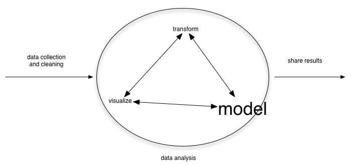
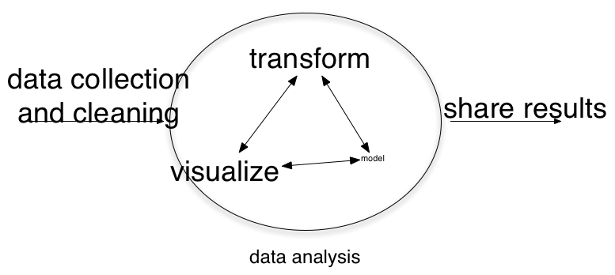

#Lecture 0: Course Overview

## Lecture Goals

Students will be able to:

- Describe the course goals
- Explain why this course might be different from what they expected
- Summarize the expectations we have for them this semester

# What is this course?

## What is this course?

Data analysis and statistical inference, not just *statistics*

## Traditional statistics class

## Actual time spent

## Often actual work looks like...

## Some statistics classes are a trick

Can be two classes in one: computing + statistics

But you only get training (and credit) on the statistics!

In this class you will receive training in (and credit for) your work on data analysis and statistical inference.  

## Goals for this course

By the end of the semester, you will:

- Be well-versed in the foundations of statistical inference, including probability, distributions, and hypothesis testing
- Be able to conduct, interpret, and communicate results from multiple regression (including dummy variables and interactions)
- Write clean, reusable, and reliable R code
- Feel empowered working with data

## My overall goals

I want this course:

- to be modern 
- to be active and (possibly?) fun
- useful for your research and career
- to meet your long term needs enabling you to learn new statistics and new programming on your own

## How I view statistics

My first graduate-level quantitative training was in fisheries:

- Statistics as a toolkit
- Model building: Emphasis is on usefullness, not correctness

"All models are wrong, some are useful" - George Box

## 

My hope is to give you a foundation so that you can:

- Learn new methods to address questions that you are interested in
- Be creative - know the rules and break them when needed!
- Not be a "hammer"

## How NOT to view statistics

It easy easy to be at one of two poles: 

cynical: "Lies, damn lies, and statistics!"

dogmatic: "Numbers = Truth"

## We will emphasize

- pragmatism
- usefullness
- healthy skepticism

Don't let perfect be the enemy of good!

# Inspirations for this class

## Inspirations for this class

- open and reproducible research
- data science
- MOOCs (massively open online courses)

## open and reproducible research

- you will be able to reproduce your own work
- you will be comfortable having your work seen by others
- we will use tools that are available to everyone in the world

## data science 

http://drewconway.com/zia/2013/3/26/the-data-science-venn-diagram

##

http://commons.wikimedia.org/wiki/File:John_Henry-27527.jpg

## 

By the time you are on the job market, computers will be 10x faster than they are now.  The trick is ride this wave rather than getting crushed by it.

In a race against the machine you will lose.

## MOOCs

- use the great educational materials that exist
- curation vs creation
- contribute to the commons

# tools

## tools

- R
- RStudio
- RMarkdown
- dplyr
- ggplot2
- tidyr
- magritrr
- git
- github

all either free or open-source (or both)

## tools

Better tools mean qualitatively different research, not just the same thing faster

Typewriter vs computer

# Expectations

## 

Five main things you have to do:
 
- prepare for class by reading
- come to class
- engage in class discussions
- do your labs and homework assignments
- finish the final project

## Homework

There will be 5 homework assignments. 

They will require a mix of data manipulation, statistical analysis, and critical assessment. 

## Homeworks

Submitted in R Markdown via github

We will talk about what that means

## Final Project

Your final project will be a 15 page paper that analyzes a topic of your choosing.

- We will talk more about details/specifics
- Intent is to: (1) Allow you to test the skills you learn in this course in a realistic application; (2) At the very least be the genesis for a conference poster/paper or journal article. 

## Tests

This class will not have tests

In an MPA class, we try to create "discerning consumers"

In this class, you are learning how to be a producer - everything in this course is intended to fit this mission. 

## Discussion

We will have a weekly discussion on pre-assigned readings

Two students will be assigned to lead discussion each week

Every student is required to come prepared with 1-pager (2-3 discussion questions, important notes or thoughts - I won't be checking length or anything)

# Course style

## This is what the course should feel like

https://www.flickr.com/photos/gasmith/3738239220/

## Collaboration

- Work together
- Use the Google
- Use stackoverflow
- Practice

## Computing logistics

- How many have laptops? Mac, Windows, Linux?
- Ask everyone to sign up for INSERT NAME OF GEORGIA TERMINAL

## Class logistics

General format each week:

- Lecture
- Discussion
- Lab

Ratio of each will vary week-to-week

## Reading

- Class will be WAY better if read the assigned material *before* class
- Class discussion will be based on the readings
- But I know that are all busy adults...

## Attendance

The same thing goes for attendance...

- I will not be taking attendance 
- You are expected to be in class
- But consistently missing discussions and labs will significantly impact your grade

## Honest talk

- I anticipate that this course will seem challenging and fast paced
- I know not all of you think of yourself as "quants", but all of you can learn this material
- I expect to learn a lot in this course as well
- We will help each other with things like good code writing

## 

Questions about expectations?

# Goal check

