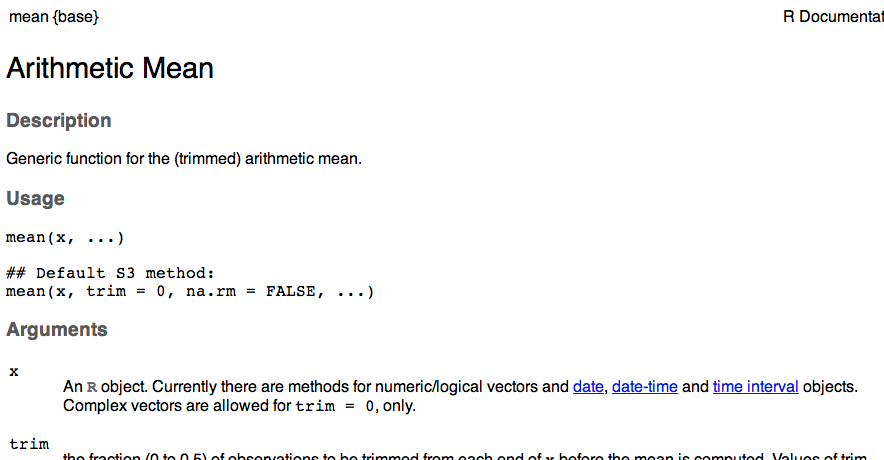
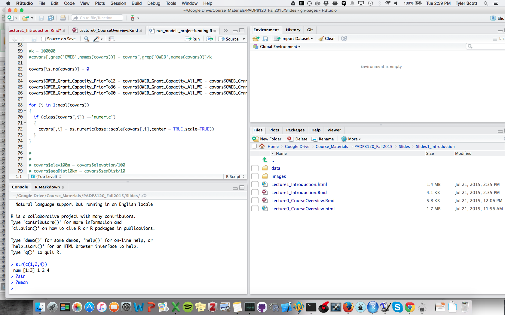
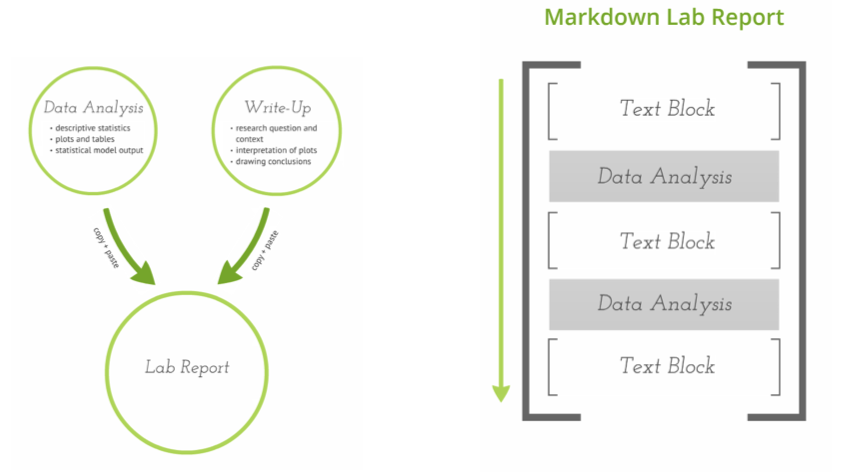
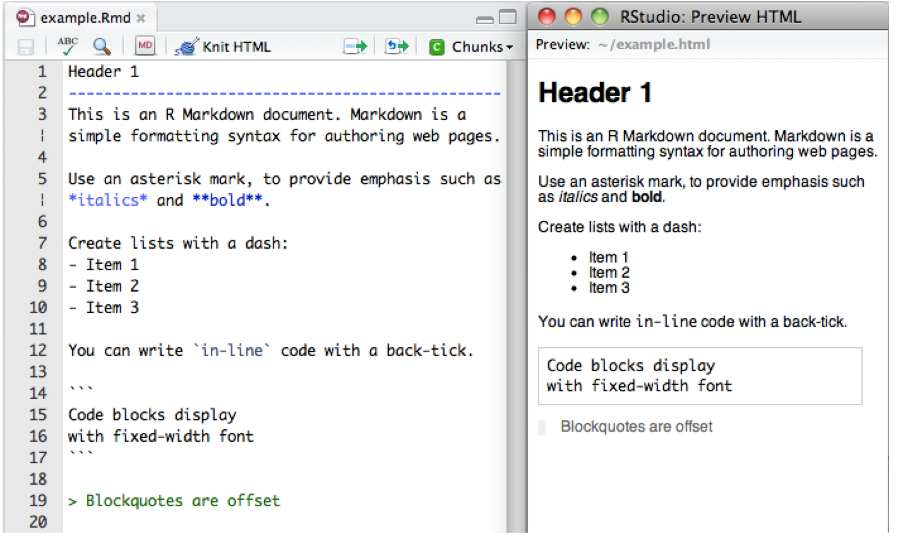

#Lecture 1: R, R Studio, and R Markdown

## Goals

After this class, students will:

- Know how R, R Studio, and R Markdown fit together
- Perform basic operations in R
- Make an R Markdown document

# R

## What is R?

"R is an integrated suite of software facilities for data manipulation, calculation and graphical display."

But what does that really mean?

## R is...

- a programming language

- an environment for interactive data analysis 

- available with a great integrated development environment (IDE): R Studio

## R is...

- Free

- Open source

- Works on windows, OSX, and unix


## Why I use R...

- Massive set of "packages" for running different models, conducting different processes, and making graphics

- Cutting edge: new research often comes with new R packages and/or code

- Great help community

- Historical accident: my mentors used R

## R is not perfect

- Relatively slow (e.g., vs. Python)

- Lots of "results-oriented people" (like us) tend to write slow/bad code

- 20 years of evolution and contributed packages fosters inconsistency

## R is one tool among many

-This course will be taught in R

-But there are other good options:
  - Stata, Julia, SPSS, SAS, Matlab, Python, even Excel
  
- By learning one programming language, I am confident that it will be easy for you to learn another if your needs change


## Object oriented programming

-Everything in R is an object or a function:

Object: z = {1,3,7,8}

Function: f(z)

## What do I need to know?

For today, not much; you will learn a ton as we go

Thankfully, a lot of R behaves like you might guess...

## Getting help: ?

```{r eval=FALSE}
?mean
```



## Learn about an object: str()

```{r}
z = c(1,3,5,10)
str(z)

colors = c('Red','Purple','Green')
str(colors)
```

## Make comments: `#`

```{r}
#Text following a '#' will not be evaluated:

#find the mean of 1, 4, and 5
mean(c(1,4,5))
```

## Logical Operations
```{r}

2 == 3
2 != 3
2 != 3 & 2 != 4
2 != 3 | 2 == 4
```

## Assign an object: <- or =
```{r}
myobject <- c(24, 12, 15)
myobject

myotherobject = c(4, 5, 7)
myotherobject
```

## Basic math:
```{r}
16 / 2
exp(12)
2 * 3 + 2
```

# R Studio

## Integrated development environment (IDE)

- code editor (write code)

- compiler (run code)

- debugger (fix code)

- GUI for files and data

- code writing help (e.g., autocomplete)

##



##
-R Studio is great for writing code, working on plots

-For big jobs, automated work, best to write a script (text file of code) and run in command line:

```{r eval=FALSE}
union:~/win/user> nohup R < run_models.R > & monitor.Rout &
[1] 43216
```

## R Markdown vs. Traditional Model


[Baumer et al (2014)](http://arxiv.org/abs/1402.1894)

## R Markdown = R + Markdown



[RMarkdown documentation](http://rmarkdown.rstudio.com/)

How many of you read and write LaTeX? HTML?

## R Markdown

In case you want to learn more, note that this workflow also involves 

- [knitr](http://yihui.name/knitr/): "Elegant, flexible and fast dynamic report generation with R"
- [pandoc](http://johnmacfarlane.net/pandoc/): "If you need to convert files from one markup format into another, pandoc is your swiss-army knife."

## R Markdown

Why R Markdown?

- enables automation
- relatively easy to learn
- gets you into a modern eco-system

## Using R Markdown

We will use R Markdown to produce homework

Final project also in R Markdown

## 
I know this is a lot to digest; we will move slowly and steadily


# Goal check


